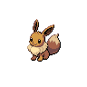

# Abundant shrine

| Area                                                                             | Pokemon                                                                                          | &nbsp;                                                                                                | &nbsp;                                                                          | &nbsp;                                                                         | &nbsp;                                                                           | &nbsp;                                                                          |
| -------------------------------------------------------------------------------- | ------------------------------------------------------------------------------------------------ | ----------------------------------------------------------------------------------------------------- | ------------------------------------------------------------------------------- | ------------------------------------------------------------------------------ | -------------------------------------------------------------------------------- | ------------------------------------------------------------------------------- |
|  grass-normal           |   [Chimecho](/pokemon/358)  20%                    |   [Vulpix](/pokemon/037)  20%                             |   [Growlithe](/pokemon/058)  10% |   [Cottonee](/pokemon/546)  10%  |   [Petilil](/pokemon/548)  10%      |   [Bronzor](/pokemon/436)  10%     |
|                                                                                  |   [Murkrow](/pokemon/198)  10%                      |   [Misdreavus](/pokemon/200)  10%                     |
|  grass-doubles        |   [Eevee](/pokemon/133)  20%                          |   [Bronzong](/pokemon/437)  20%                         |   [Girafarig](/pokemon/203)  10% |   [Stantler](/pokemon/234)  10%  |   [Hypno](/pokemon/097)  10%          |   [Mightyena](/pokemon/262)  10% |
|                                                                                  |   [Mr-mime](/pokemon/122)  10%                      |   [Sudowoodo](/pokemon/185)  10%                       |
|  grass-special        |   [Audino](/pokemon/531)  70%                        |   [Emolga](/pokemon/587)  10%                             |   [Arcanine](/pokemon/059)  5%    |   [Ninetales](/pokemon/038)  5% |   [Whimsicott](/pokemon/547)  5% |   [Lilligant](/pokemon/549)  5%  |
|  surf-normal              |   [Slowpoke](/pokemon/079)  100%                   |
|  surf-special           |   [Slowking](/pokemon/199)  60%                    |   [Slowbro](/pokemon/080)  40%                           |
|  fishing-normal     |   [Goldeen](/pokemon/118)  70%                      |   [Basculin-red-striped](/pokemon/550)  30% |
|  fishing-special  |   [Goldeen](/pokemon/118)  60%                      |   [Basculin-red-striped](/pokemon/550)  30% |   [Seaking](/pokemon/119)  10%     |
| legendary-encounter grass-special                                            |   [Ho-oh](/pokemon/250)  1%                           |
| legendary-encounter abundant-shrine                                          |   [Landorus-incarnate](/pokemon/645)  0% |