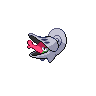

# Castelia city gym

| Trainer                                                                                        | 1                                                                                    | 2                                                                                    | 3                                                                                  | 4                                                                                | 5                                                                                    | 6                                                                                |
| ---------------------------------------------------------------------------------------------- | ------------------------------------------------------------------------------------ | ------------------------------------------------------------------------------------ | ---------------------------------------------------------------------------------- | -------------------------------------------------------------------------------- | ------------------------------------------------------------------------------------ | -------------------------------------------------------------------------------- |
| Harlequin Jack                                                                                 |   [Metapod](/pokemon/011)  Lv. 26       |   [Kakuna](/pokemon/014)  Lv. 26         |   [Silcoon](/pokemon/266)  Lv. 26     |   [Cascoon](/pokemon/268)  Lv. 26   |   [Kricketune](/pokemon/402)  Lv. 26 |
| Harlequin Kerry                                                                                |   [Surskit](/pokemon/283)  Lv. 26       |   [Butterfree](/pokemon/012)  Lv. 26 |   [Beautifly](/pokemon/267)  Lv. 26 |   [Volbeat](/pokemon/313)  Lv. 26   |   [Illumise](/pokemon/314)  Lv. 26     |
| Harlequin Rick                                                                                 |   [Dwebble](/pokemon/557)  Lv. 26       |   [Karrablast](/pokemon/588)  Lv. 26 |   [Shelmet](/pokemon/616)  Lv. 26     |   [Swadloon](/pokemon/541)  Lv. 26 |   [Whirlipede](/pokemon/544)  Lv. 26 |
| Harlequin Louis                                                                                |   [Paras](/pokemon/046)  Lv. 26           |   [Anorith](/pokemon/347)  Lv. 26       |   [Pineco](/pokemon/204)  Lv. 26       |   [Yanma](/pokemon/193)  Lv. 26       |   [Venonat](/pokemon/048)  Lv. 26       |
| Leader Burgh   |   [Masquerain](/pokemon/284)  Lv. 28 |   [Vespiquen](/pokemon/416)  Lv. 28   |   [Heracross](/pokemon/214)  Lv. 28 |   [Yanmega](/pokemon/469)  Lv. 28   |   [Scolipede](/pokemon/545)  Lv. 30   |   [Leavanny](/pokemon/542)  Lv. 30 |

## Leader Burgh

|          | Item                                                                 | Nature | Ability      | Moves                                                                                 |
| ------------------------------------------------------------------------------------ | -------------------------------------------------------------------- | ------ | ------------ | ------------------------------------------------------------------------------------- |
|   [Masquerain](/pokemon/284)  Lv. 28 | N/A                                                                  | N/A    | Levitate     | <ul><li>Scald</li><li>Silver-Wind</li><li>Stun-Spore</li><li>Icy-Wind</li></ul>       |
|   [Vespiquen](/pokemon/416)  Lv. 28   | N/A                                                                  | N/A    | Pressure     | <ul><li>Acrobatics</li><li>Toxic</li><li>Heal-Order</li><li>U-Turn</li></ul>          |
|   [Heracross](/pokemon/214)  Lv. 28   |    Flame orb          | N/A    | Guts         | <ul><li>Brick-Break</li><li>Aerial-Ace</li><li>Bug-Bite</li><li>Night-Slash</li></ul> |
|   [Yanmega](/pokemon/469)  Lv. 28       | N/A                                                                  | N/A    | Speed-Boost  | <ul><li>Protect</li><li>U-Turn</li><li>Air-Slash</li><li>Signal-Beam</li></ul>        |
|   [Scolipede](/pokemon/545)  Lv. 30   |    Sitrus berry | N/A    | Poison-Touch | <ul><li>Toxic</li><li>Rock-Climb</li><li>Megahorn</li><li>Rock-Slide</li></ul>        |
|   [Leavanny](/pokemon/542)  Lv. 30     |    Sitrus berry | N/A    | Swarm        | <ul><li>Protect</li><li>Leaf-Blade</li><li>X-Scissor</li><li>Grass-Whistle</li></ul>  |