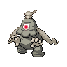

# Celestial tower - 3f

| Trainer       | 1                                                                                                 | 2                                                                                                     | 3                                                                                                     | 4                                                                                                 |
| ------------- | ------------------------------------------------------------------------------------------------- | ----------------------------------------------------------------------------------------------------- | ----------------------------------------------------------------------------------------------------- | ------------------------------------------------------------------------------------------------- |
| Psychic Micki |   [Lampent](/blaze-black-wiki/pokemon/608)  Lv. 48   |   [Cofagrigus](/blaze-black-wiki/pokemon/563)  Lv. 48 |   [Mismagius](/blaze-black-wiki/pokemon/429)  Lv. 48   |
| Psychic Lin   |   [Swoobat](/blaze-black-wiki/pokemon/528)  Lv. 48   |   [Gardevoir](/blaze-black-wiki/pokemon/282)  Lv. 48   |   [Gothitelle](/blaze-black-wiki/pokemon/576)  Lv. 48 |
| Psychic Bryce |   [Musharna](/blaze-black-wiki/pokemon/518)  Lv. 48 |   [Spiritomb](/blaze-black-wiki/pokemon/442)  Lv. 48   |   [Dusclops](/blaze-black-wiki/pokemon/356)  Lv. 48     |   [Alakazam](/blaze-black-wiki/pokemon/065)  Lv. 48 |
| Psychic Belle |   [Gallade](/blaze-black-wiki/pokemon/475)  Lv. 48   |   [Froslass](/blaze-black-wiki/pokemon/478)  Lv. 48     |   [Slowbro](/blaze-black-wiki/pokemon/080)  Lv. 48       |
| Nurse Sachiko |   [Espeon](/blaze-black-wiki/pokemon/196)  Lv. 49     |   [Blissey](/blaze-black-wiki/pokemon/242)  Lv. 49       |