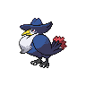
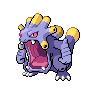

# Chargestone cave - b1f

| Trainer             | 1                                                                                  | 2                                                                                  | 3                                                                                  | 4                                                                                  |
| ------------------- | ---------------------------------------------------------------------------------- | ---------------------------------------------------------------------------------- | ---------------------------------------------------------------------------------- | ---------------------------------------------------------------------------------- |
| Doctor Wayne        |   [Reuniclus](/pokemon/579)  Lv. 41 |
| Team Plasma Grunt 1 |   [Krokorok](/pokemon/552)  Lv. 39   |   [Watchog](/pokemon/505)  Lv. 39     |   [Scrafty](/pokemon/560)  Lv. 39     |
| Team Plasma Grunt 2 |   [Eelektrik](/pokemon/603)  Lv. 39 |   [Banette](/pokemon/354)  Lv. 39     |   [Crawdaunt](/pokemon/342)  Lv. 39 |
| Team Plasma Grunt 3 |   [Pawniard](/pokemon/624)  Lv. 38   |   [Cacturne](/pokemon/332)  Lv. 38   |   [Scraggy](/pokemon/559)  Lv. 38     |   [Mightyena](/pokemon/262)  Lv. 38 |
| Team Plasma Grunt 4 |   [Garbodor](/pokemon/569)  Lv. 41   |   [Weezing](/pokemon/110)  Lv. 41     |
| Team Plasma Grunt 5 |   [Arbok](/pokemon/024)  Lv. 39         |   [Honchkrow](/pokemon/430)  Lv. 39 |   [Vileplume](/pokemon/045)  Lv. 39 |
| Team Plasma Grunt 6 |   [Exploud](/pokemon/295)  Lv. 42     |
| Team Plasma Grunt 7 |   [Garbodor](/pokemon/569)  Lv. 42   |