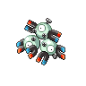

# Chargestone cave - b2f

| Area                                                                                            | Pokemon                                                                           | &nbsp;                                                                         | &nbsp;                                                                            | &nbsp;                                                                        | &nbsp;                                                                          | &nbsp;                                                                            |
| ----------------------------------------------------------------------------------------------- | --------------------------------------------------------------------------------- | ------------------------------------------------------------------------------ | --------------------------------------------------------------------------------- | ----------------------------------------------------------------------------- | ------------------------------------------------------------------------------- | --------------------------------------------------------------------------------- |
|  cave-normal                             |   [Galvantula](/pokemon/596)  20% |   [Klang](/pokemon/600)  20%        |   [Electabuzz](/pokemon/125)  10% |   [Magneton](/pokemon/082)  10% |   [Electrode](/pokemon/101)  10% |   [Ferrothorn](/pokemon/598)  10% |
|                                                                                                 |   [Durant](/pokemon/632)  5%          |   [Eelektrik](/pokemon/603)  5% |   [Porygon](/pokemon/137)  5%        |   [Rotom](/pokemon/479)  4%        |
|  cave-special                          |   [Excadrill](/pokemon/530)  50%   |   [Dugtrio](/pokemon/051)  50%    |
|  legendary-encounter   |   [Zapdos](/pokemon/145)  1%          |