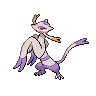

# Cold storage

| Area                                                                       | Pokemon                                                                         | &nbsp;                                                                          | &nbsp;                                                                      | &nbsp;                                                                        | &nbsp;                                                                      | &nbsp;                                                                        |
| -------------------------------------------------------------------------- | ------------------------------------------------------------------------------- | ------------------------------------------------------------------------------- | --------------------------------------------------------------------------- | ----------------------------------------------------------------------------- | --------------------------------------------------------------------------- | ----------------------------------------------------------------------------- |
|  grass-normal     |   [Vanillite](/pokemon/582)  20% |   [Herdier](/pokemon/507)  20%     |   [Snorunt](/pokemon/361)  10% |   [Swinub](/pokemon/220)  10%     |   [Cubchoo](/pokemon/613)  10% |   [Buizel](/pokemon/418)  10%     |
|                                                                            |   [Mienfoo](/pokemon/619)  10%     |   [Taillow](/pokemon/276)  10%     |
|  grass-doubles  |   [Vanillish](/pokemon/583)  20% |   [Herdier](/pokemon/507)  20%     |   [Swellow](/pokemon/277)  10% |   [Floatzel](/pokemon/419)  10% |   [Sneasel](/pokemon/215)  10% |   [Delibird](/pokemon/225)  10% |
|                                                                            |   [Smoochum](/pokemon/238)  10%   |   [Piloswine](/pokemon/221)  10% |
|  grass-special  |   [Audino](/pokemon/531)  90%       |   [Mienshao](/pokemon/620)  10%   |