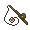

# Dragonspiral tower - outside

| Area                                                                             | Pokemon                                                                                        | &nbsp;                                                                                                                 | &nbsp;                                                                                           | &nbsp;                                                                                          | &nbsp;                                                                                       |
| -------------------------------------------------------------------------------- | ---------------------------------------------------------------------------------------------- | ---------------------------------------------------------------------------------------------------------------------- | ------------------------------------------------------------------------------------------------ | ----------------------------------------------------------------------------------------------- | -------------------------------------------------------------------------------------------- |
|  grass-normal           |   [Mienfoo](/blaze-black-wiki/pokemon/619)  20%   |   [Deerling](/blaze-black-wiki/pokemon/585)  20%                         |   [Druddigon](/blaze-black-wiki/pokemon/621)  20% |   [Swablu](/blaze-black-wiki/pokemon/333)  20%      |   [Kadabra](/blaze-black-wiki/pokemon/064)  20% |
|  grass-doubles        |   [Mienshao](/blaze-black-wiki/pokemon/620)  20% |   [Sawsbuck](/blaze-black-wiki/pokemon/586)  20%                         |   [Druddigon](/blaze-black-wiki/pokemon/621)  20% |   [Altaria](/blaze-black-wiki/pokemon/334)  20%    |   [Kadabra](/blaze-black-wiki/pokemon/064)  20% |
|  grass-special        |   [Audino](/blaze-black-wiki/pokemon/531)  90%     |   [Alakazam](/blaze-black-wiki/pokemon/065)  10%                         |
|  surf-normal              |   [Horsea](/blaze-black-wiki/pokemon/116)  60%     |   [Dratini](/blaze-black-wiki/pokemon/147)  40%                           |
|  surf-special           |   [Seadra](/blaze-black-wiki/pokemon/117)  60%     |   [Dragonair](/blaze-black-wiki/pokemon/148)  40%                       |
|  fishing-normal     |   [Horsea](/blaze-black-wiki/pokemon/116)  60%     |   [Basculin-red-striped](/blaze-black-wiki/pokemon/550)  30% |   [Dratini](/blaze-black-wiki/pokemon/147)  10%     |
|  fishing-special  |   [Seadra](/blaze-black-wiki/pokemon/117)  60%     |   [Dragonair](/blaze-black-wiki/pokemon/148)  30%                       |   [Kingdra](/blaze-black-wiki/pokemon/230)  9%      |   [Dragonite](/blaze-black-wiki/pokemon/149)  1% |
| legendary-encounter surf-special                                             |   [Suicune](/blaze-black-wiki/pokemon/245)  1%    |