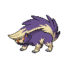

# Dragonsprial tower - inside

| Trainer              | 1                                                                                                     | 2                                                                                                     | 3                                                                                                 |
| -------------------- | ----------------------------------------------------------------------------------------------------- | ----------------------------------------------------------------------------------------------------- | ------------------------------------------------------------------------------------------------- |
| Team Plasma Grunt 1  |   [Mightyena](/blaze-black-wiki/pokemon/262)  Lv. 56   |   [Garbodor](/blaze-black-wiki/pokemon/569)  Lv. 56     |   [Purugly](/blaze-black-wiki/pokemon/432)  Lv. 56   |
| Team Plasma Grunt 2  |   [Bisharp](/blaze-black-wiki/pokemon/625)  Lv. 60       |
| Team Plasma Grunt 3  |   [Muk](/blaze-black-wiki/pokemon/089)  Lv. 58               |
| Team Plasma Grunt 4  |   [Eelektross](/blaze-black-wiki/pokemon/604)  Lv. 60 |
| Team Plasma Grunt 5  |   [Raticate](/blaze-black-wiki/pokemon/020)  Lv. 56     |   [Watchog](/blaze-black-wiki/pokemon/505)  Lv. 56       |   [Skuntank](/blaze-black-wiki/pokemon/435)  Lv. 56 |
| Team Plasma Grunt 7  |   [Scrafty](/blaze-black-wiki/pokemon/560)  Lv. 57       |   [Krookodile](/blaze-black-wiki/pokemon/553)  Lv. 57 |
| Team Plasma Grunt 8  |   [Liepard](/blaze-black-wiki/pokemon/510)  Lv. 57       |   [Shiftry](/blaze-black-wiki/pokemon/275)  Lv. 57       |
| Team Plasma Grunt 9  |   [Dusknoir](/blaze-black-wiki/pokemon/477)  Lv. 60     |
| Team Plasma Grunt 10 |   [Drapion](/blaze-black-wiki/pokemon/452)  Lv. 60       |