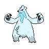
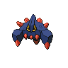

# Giant chasm - inside cave

| Area                                                                             | Pokemon                                                                          | &nbsp;                                                                                                | &nbsp;                                                                         | &nbsp;                                                                      | &nbsp;                                                                      | &nbsp;                                                                          |
| -------------------------------------------------------------------------------- | -------------------------------------------------------------------------------- | ----------------------------------------------------------------------------------------------------- | ------------------------------------------------------------------------------ | --------------------------------------------------------------------------- | --------------------------------------------------------------------------- | ------------------------------------------------------------------------------- |
|  cave-normal              |   [Woobat](/pokemon/527)  20%        |   [Jynx](/pokemon/124)  20%                                 |   [Glalie](/pokemon/362)  10%      |   [Beartic](/pokemon/614)  10% |   [Slowbro](/pokemon/080)  10% |   [Piloswine](/pokemon/221)  10% |
|                                                                                  |   [Graveler](/pokemon/075)  10%    |   [Boldore](/pokemon/525)  10%                           |
|  cave-special           |   [Excadrill](/pokemon/530)  100% |
|  surf-normal              |   [Seel](/pokemon/086)  60%            |   [Dewgong](/pokemon/087)  40%                           |
|  fishing-normal     |   [Poliwag](/pokemon/060)  65%      |   [Basculin-red-striped](/pokemon/550)  30% |   [Poliwhirl](/pokemon/061)  5% |
|  fishing-special  |   [Poliwhirl](/pokemon/061)  65%  |   [Basculin-red-striped](/pokemon/550)  30% |   [Poliwrath](/pokemon/062)  5% |
| legendary-encounter cave-normal                                              |   [Dialga](/pokemon/483)  1%         |   [Palkia](/pokemon/484)  1%                              |
| legendary-encounter rear-cave                                                |   [Kyurem](/pokemon/646)  0%         |