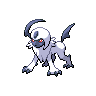
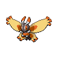

# Giant chasm - outside area

| Area                                                                                                                                   | Pokemon                                                                                | &nbsp;                                                                         | &nbsp;                                                                        | &nbsp;                                                                        | &nbsp;                                                                         | &nbsp;                                                                                    |
| -------------------------------------------------------------------------------------------------------------------------------------- | -------------------------------------------------------------------------------------- | ------------------------------------------------------------------------------ | ----------------------------------------------------------------------------- | ----------------------------------------------------------------------------- | ------------------------------------------------------------------------------ | ----------------------------------------------------------------------------------------- |
|  grass-normal                                                                 |   [Absol](/pokemon/359)  20%                |   [Drifblim](/pokemon/426)  20%  |   [Swellow](/pokemon/277)  10%   |   [Lunatone](/pokemon/337)  10% |   [Solrock](/pokemon/338)  10%    |   [Wormadam-plant](/pokemon/413)  10% |
|                                                                                                                                        |   [Mothim](/pokemon/414)  10%              |   [Pelipper](/pokemon/279)  10%  |
|  grass-doubles                                                              |   [Golbat](/pokemon/042)  20%              |   [Tangela](/pokemon/114)  20%    |   [Nidorino](/pokemon/033)  10% |   [Nidorina](/pokemon/030)  10% |   [Yanma](/pokemon/193)  10%        |   [Gloom](/pokemon/044)  10%                   |
|                                                                                                                                        |   [Weepinbell](/pokemon/070)  10%      |   [Skiploom](/pokemon/188)  10%  |
|  grass-special                                                              |   [Audino](/pokemon/531)  80%              |   [Tangrowth](/pokemon/465)  5% |   [Crobat](/pokemon/169)  5%      |   [Nidoking](/pokemon/034)  5%  |   [Nidoqueen](/pokemon/031)  5% |
|  legendary-encounter grass-doubles  |   [Deoxys-normal](/pokemon/386)  1% |