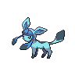

# Iccirus city gym

| Trainer                                                                                           | 1                                                                                  | 2                                                                                  | 3                                                                                  | 4                                                                                  | 5                                                                                  | 6                                                                              |
| ------------------------------------------------------------------------------------------------- | ---------------------------------------------------------------------------------- | ---------------------------------------------------------------------------------- | ---------------------------------------------------------------------------------- | ---------------------------------------------------------------------------------- | ---------------------------------------------------------------------------------- | ------------------------------------------------------------------------------ |
| Black Belt Grant                                                                                  |   [Swinub](/pokemon/220)  Lv. 56       |   [Piloswine](/pokemon/221)  Lv. 56 |   [Mamoswine](/pokemon/473)  Lv. 56 |
| Battle Girl Miriam                                                                                |   [Dewgong](/pokemon/087)  Lv. 54     |   [Cloyster](/pokemon/091)  Lv. 53   |   [Slowbro](/pokemon/080)  Lv. 54     |   [Jynx](/pokemon/124)  Lv. 56           |   [Lapras](/pokemon/131)  Lv. 56       |
| Black Belt Kendrew                                                                                |   [Snover](/pokemon/459)  Lv. 56       |   [Sneasel](/pokemon/215)  Lv. 56     |   [Cubchoo](/pokemon/613)  Lv. 56     |   [Weavile](/pokemon/461)  Lv. 56     |
| Black Girl Mikiko                                                                                 |   [Vanillish](/pokemon/583)  Lv. 57 |   [Sealeo](/pokemon/364)  Lv. 57       |   [Jynx](/pokemon/124)  Lv. 57           |   [Walrein](/pokemon/365)  Lv. 57     |
| Black Girl Chandra                                                                                |   [Froslass](/pokemon/478)  Lv. 57   |   [Cryogonal](/pokemon/615)  Lv. 57 |   [Abomasnow](/pokemon/460)  Lv. 57 |
| Black Belt Thomas                                                                                 |   [Delibird](/pokemon/225)  Lv. 58   |   [Glalie](/pokemon/362)  Lv. 58       |   [Glaceon](/pokemon/471)  Lv. 58     |
| Leader Brycen   |   [Abomasnow](/pokemon/460)  Lv. 61 |   [Glaceon](/pokemon/471)  Lv. 61     |   [Froslass](/pokemon/478)  Lv. 61   |   [Vanilluxe](/pokemon/584)  Lv. 63 |   [Cryogonal](/pokemon/615)  Lv. 61 |   [Beartic](/pokemon/614)  Lv. 63 |

## Leader Brycen

|      | Item                                                                       | Nature | Ability      | Moves                                                                                    |
| ---------------------------------------------------------------------------------- | -------------------------------------------------------------------------- | ------ | ------------ | ---------------------------------------------------------------------------------------- |
|   [Abomasnow](/pokemon/460)  Lv. 61 |    Expert belt          | N/A    | Snow-Warning | <ul><li>Blizzard</li><li>Wood-Hammer</li><li>Focus-Blast</li><li>Ice-Shard</li></ul>     |
|   [Glaceon](/pokemon/471)  Lv. 61     |    Choice scarf       | N/A    | Serene-Grace | <ul><li>Blizzard</li><li>Earth-Power</li><li>Shadow-Ball</li><li>Baton-Pass</li></ul>    |
|   [Froslass](/pokemon/478)  Lv. 61   |    Life orb                   | N/A    | Levitate     | <ul><li>Blizzard</li><li>Thunderbolt</li><li>Shadow-Ball</li><li>Disable</li></ul>       |
|   [Vanilluxe](/pokemon/584)  Lv. 63 |    Never melt ice | N/A    | Weak-Armor   | <ul><li>Blizzard</li><li>Flash-Cannon</li><li>Energy-Ball</li><li>Autotomize</li></ul>   |
|   [Cryogonal](/pokemon/615)  Lv. 61 |    Focus sash             | N/A    | Levitate     | <ul><li>Blizzard</li><li>Reflect</li><li>Hidden-Power</li><li>Protect</li></ul>          |
|   [Beartic](/pokemon/614)  Lv. 63     |    White herb             | N/A    | Sheer-Force  | <ul><li>Icicle-Crash</li><li>Close-Combat</li><li>Waterfall</li><li>Rock-Slide</li></ul> |