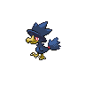
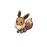

# Lostlorn forest

| Area                                                                                                                                | Pokemon                                                                           | &nbsp;                                                                         | &nbsp;                                                                                    | &nbsp;                                                                            | &nbsp;                                                                            | &nbsp;                                                                      |
| ----------------------------------------------------------------------------------------------------------------------------------- | --------------------------------------------------------------------------------- | ------------------------------------------------------------------------------ | ----------------------------------------------------------------------------------------- | --------------------------------------------------------------------------------- | --------------------------------------------------------------------------------- | --------------------------------------------------------------------------- |
|  grass-normal                                                              |   [Karrablast](/pokemon/588)  20% |   [Shelmet](/pokemon/616)  20%    |   [Yanma](/pokemon/193)  10%                   |   [Pichu](/pokemon/172)  10%           |   [Psyduck](/pokemon/054)  10%       |   [Surskit](/pokemon/283)  10% |
|                                                                                                                                     |   [Farfetchd](/pokemon/083)  5%    |   [Chatot](/pokemon/441)  5%       |   [Misdreavus](/pokemon/200)  5%          |   [Murkrow](/pokemon/198)  5%        |
|  grass-doubles                                                           |   [Escavalier](/pokemon/589)  20% |   [Accelgor](/pokemon/617)  20%  |   [Wormadam-plant](/pokemon/413)  10% |   [Mothim](/pokemon/414)  10%         |   [Masquerain](/pokemon/284)  10% |   [Golduck](/pokemon/055)  10% |
|                                                                                                                                     |   [Farfetchd](/pokemon/083)  5%    |   [Chatot](/pokemon/441)  5%       |   [Swadloon](/pokemon/541)  5%              |   [Whirlipede](/pokemon/544)  5%  |
|  grass-special                                                           |   [Audino](/pokemon/531)  40%         |   [Pikachu](/pokemon/025)  10%    |   [Kecleon](/pokemon/352)  10%               |   [Whimsicott](/pokemon/547)  10% |   [Lilligant](/pokemon/549)  10%   |   [Zorua](/pokemon/570)  5%      |
|                                                                                                                                     |   [Eevee](/pokemon/133)  5%            |   [Mismagius](/pokemon/429)  5% |   [Honchkrow](/pokemon/430)  5%            |
|  surf-normal                                                                 |   [Magikarp](/pokemon/129)  100%    |
|  surf-special                                                              |   [Gyarados](/pokemon/130)  100%    |
|  fishing-normal                                                        |   [Carvanha](/pokemon/318)  60%     |   [Magikarp](/pokemon/129)  30%  |   [Goldeen](/pokemon/118)  10%               |
|  fishing-special                                                     |   [Sharpedo](/pokemon/319)  60%     |   [Seaking](/pokemon/119)  30%    |   [Gyarados](/pokemon/130)  10%             |
|  legendary-encounter Double Grass  |   [Celebi](/pokemon/251)  1%          |   [Mew](/pokemon/151)  1%             |