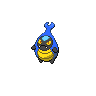
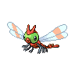

# Lostlorn forest

| Area                                                                             | Pokemon                                                                                            | &nbsp;                                                                                          | &nbsp;                                                                                                     | &nbsp;                                                                                             | &nbsp;                                                                                             | &nbsp;                                                                                       |
| -------------------------------------------------------------------------------- | -------------------------------------------------------------------------------------------------- | ----------------------------------------------------------------------------------------------- | ---------------------------------------------------------------------------------------------------------- | -------------------------------------------------------------------------------------------------- | -------------------------------------------------------------------------------------------------- | -------------------------------------------------------------------------------------------- |
|  grass-normal           |   [Karrablast](/blaze-black-wiki/pokemon/588)  20% |   [Shelmet](/blaze-black-wiki/pokemon/616)  20%    |   [Yanma](/blaze-black-wiki/pokemon/193)  10%                   |   [Pichu](/blaze-black-wiki/pokemon/172)  10%           |   [Psyduck](/blaze-black-wiki/pokemon/054)  10%       |   [Surskit](/blaze-black-wiki/pokemon/283)  10% |
|                                                                                  |   [Farfetchd](/blaze-black-wiki/pokemon/083)  5%    |   [Chatot](/blaze-black-wiki/pokemon/441)  5%       |   [Misdreavus](/blaze-black-wiki/pokemon/200)  5%          |   [Murkrow](/blaze-black-wiki/pokemon/198)  5%        |
|  grass-doubles        |   [Escavalier](/blaze-black-wiki/pokemon/589)  20% |   [Accelgor](/blaze-black-wiki/pokemon/617)  20%  |   [Wormadam-plant](/blaze-black-wiki/pokemon/413)  10% |   [Mothim](/blaze-black-wiki/pokemon/414)  10%         |   [Masquerain](/blaze-black-wiki/pokemon/284)  10% |   [Golduck](/blaze-black-wiki/pokemon/055)  10% |
|                                                                                  |   [Farfetchd](/blaze-black-wiki/pokemon/083)  5%    |   [Chatot](/blaze-black-wiki/pokemon/441)  5%       |   [Swadloon](/blaze-black-wiki/pokemon/541)  5%              |   [Whirlipede](/blaze-black-wiki/pokemon/544)  5%  |
|  grass-special        |   [Audino](/blaze-black-wiki/pokemon/531)  40%         |   [Pikachu](/blaze-black-wiki/pokemon/025)  10%    |   [Kecleon](/blaze-black-wiki/pokemon/352)  10%               |   [Whimsicott](/blaze-black-wiki/pokemon/547)  10% |   [Lilligant](/blaze-black-wiki/pokemon/549)  10%   |   [Zorua](/blaze-black-wiki/pokemon/570)  5%      |
|                                                                                  |   [Eevee](/blaze-black-wiki/pokemon/133)  5%            |   [Mismagius](/blaze-black-wiki/pokemon/429)  5% |   [Honchkrow](/blaze-black-wiki/pokemon/430)  5%            |
|  surf-normal              |   [Magikarp](/blaze-black-wiki/pokemon/129)  100%    |
|  surf-special           |   [Gyarados](/blaze-black-wiki/pokemon/130)  100%    |
|  fishing-normal     |   [Carvanha](/blaze-black-wiki/pokemon/318)  60%     |   [Magikarp](/blaze-black-wiki/pokemon/129)  30%  |   [Goldeen](/blaze-black-wiki/pokemon/118)  10%               |
|  fishing-special  |   [Sharpedo](/blaze-black-wiki/pokemon/319)  60%     |   [Seaking](/blaze-black-wiki/pokemon/119)  30%    |   [Gyarados](/blaze-black-wiki/pokemon/130)  10%             |
| legendary-encounter Double Grass                                             |   [Celebi](/blaze-black-wiki/pokemon/251)  1%          |   [Mew](/blaze-black-wiki/pokemon/151)  1%             |