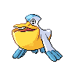

# Marvelous bridge

| Area                                                                          | Pokemon                                                                                       | &nbsp;                                                                                         | &nbsp;                                                                                       | &nbsp;                                                                                     | &nbsp;                                                                                         |
| ----------------------------------------------------------------------------- | --------------------------------------------------------------------------------------------- | ---------------------------------------------------------------------------------------------- | -------------------------------------------------------------------------------------------- | ------------------------------------------------------------------------------------------ | ---------------------------------------------------------------------------------------------- |
|  bridge-special  |   [Swanna](/blaze-black-wiki/pokemon/581)  20%    |   [Pelipper](/blaze-black-wiki/pokemon/279)  20% |   [Altaria](/blaze-black-wiki/pokemon/334)  20% |   [Fearow](/blaze-black-wiki/pokemon/022)  20% |   [Skiploom](/blaze-black-wiki/pokemon/188)  20% |
| legendary-encounter bridge-special                                        |   [Rayquaza](/blaze-black-wiki/pokemon/384)  1% |