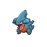

# Mistralton cave - 2f

| Area                                                                                                                             | Pokemon                                                                     | &nbsp;                                                                      | &nbsp;                                                                        | &nbsp;                                                                  | &nbsp;                                                                    | &nbsp;                                                                  |
| -------------------------------------------------------------------------------------------------------------------------------- | --------------------------------------------------------------------------- | --------------------------------------------------------------------------- | ----------------------------------------------------------------------------- | ----------------------------------------------------------------------- | ------------------------------------------------------------------------- | ----------------------------------------------------------------------- |
|  cave-normal                                                              |   [Onix](/pokemon/095)  20%       |   [Rhyhorn](/pokemon/111)  20% |   [Larvitar](/pokemon/246)  10% |   [Bagon](/pokemon/371)  10% |   [Beldum](/pokemon/374)  10% |   [Gible](/pokemon/443)  10% |
|                                                                                                                                  |   [Axew](/pokemon/610)  10%       |   [Deino](/pokemon/633)  10%     |
|  cave-special                                                           |   [Drilbur](/pokemon/529)  50% |   [Diglett](/pokemon/050)  50% |
|  legendary-encounter cave-normal  |   [Mesprit](/pokemon/481)  1%  |