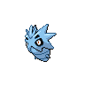
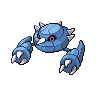
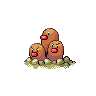

# Mistralton cave - 3f (guidance chamber)

| Area                                                                    | Pokemon                                                                         | &nbsp;                                                                        | &nbsp;                                                                      | &nbsp;                                                                      | &nbsp;                                                                    | &nbsp;                                                                    |
| ----------------------------------------------------------------------- | ------------------------------------------------------------------------------- | ----------------------------------------------------------------------------- | --------------------------------------------------------------------------- | --------------------------------------------------------------------------- | ------------------------------------------------------------------------- | ------------------------------------------------------------------------- |
|  cave-normal     |   [Steelix](/pokemon/208)  20%     |   [Rhydon](/pokemon/112)  20%     |   [Pupitar](/pokemon/247)  10% |   [Shelgon](/pokemon/372)  10% |   [Metang](/pokemon/375)  10% |   [Gabite](/pokemon/444)  10% |
|                                                                         |   [Fraxure](/pokemon/611)  10%     |   [Zweilous](/pokemon/634)  10% |
|  cave-special  |   [Excadrill](/pokemon/530)  50% |   [Dugtrio](/pokemon/051)  50%   |
| legendary-encounter cave-normal                                     |   [Azelf](/pokemon/482)  1%          |
| legendary-encounter guidance-chamber                                |   [Cobalion](/pokemon/638)  1%    |