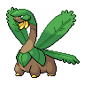
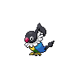
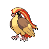

# Mistralton city gym

| Trainer                                                                                        | 1                                                                                  | 2                                                                                  | 3                                                                                    | 4                                                                                  | 5                                                                                  | 6                                                                            |
| ---------------------------------------------------------------------------------------------- | ---------------------------------------------------------------------------------- | ---------------------------------------------------------------------------------- | ------------------------------------------------------------------------------------ | ---------------------------------------------------------------------------------- | ---------------------------------------------------------------------------------- | ---------------------------------------------------------------------------- |
| Worker Cliff                                                                                   |   [Mantine](/pokemon/226)  Lv. 50     |   [Crobat](/pokemon/169)  Lv. 50       |   [Togekiss](/pokemon/468)  Lv. 50     |   [Charizard](/pokemon/006)  Lv. 50 |   [Honchkrow](/pokemon/430)  Lv. 50 |
| Worker Brady                                                                                   |   [Swoobat](/pokemon/528)  Lv. 51     |   [Staraptor](/pokemon/398)  Lv. 51 |   [Altaria](/pokemon/334)  Lv. 51       |   [Drifblim](/pokemon/426)  Lv. 51   |   [Tropius](/pokemon/357)  Lv. 51     |
| Pilot Ted                                                                                      |   [Chatot](/pokemon/441)  Lv. 50       |   [Sigilyph](/pokemon/561)  Lv. 50   |   [Unfezant](/pokemon/521)  Lv. 50     |   [Scyther](/pokemon/123)  Lv. 50     |   [Delibird](/pokemon/225)  Lv. 50   |
| Pilot Chase                                                                                    |   [Jumpluff](/pokemon/189)  Lv. 50   |   [Xatu](/pokemon/178)  Lv. 50           |   [Noctowl](/pokemon/164)  Lv. 50       |   [Pelipper](/pokemon/279)  Lv. 50   |   [Ledian](/pokemon/166)  Lv. 50       |
| Worker Arnold                                                                                  |   [Swellow](/pokemon/277)  Lv. 52     |   [Farfetchd](/pokemon/083)  Lv. 52 |   [Aerodactyl](/pokemon/142)  Lv. 52 |   [Archeops](/pokemon/567)  Lv. 52   |   [Pidgeot](/pokemon/018)  Lv. 52     |
| Leader Skyla   |   [Mandibuzz](/pokemon/630)  Lv. 54 |   [Skarmory](/pokemon/227)  Lv. 54   |   [Braviary](/pokemon/628)  Lv. 54     |   [Archeops](/pokemon/567)  Lv. 54   |   [Gliscor](/pokemon/472)  Lv. 54     |   [Swanna](/pokemon/581)  Lv. 54 |

## Leader Skyla

|        | Item                                                                 | Nature | Ability     | Moves                                                                                  |
| ---------------------------------------------------------------------------------- | -------------------------------------------------------------------- | ------ | ----------- | -------------------------------------------------------------------------------------- |
|   [Mandibuzz](/pokemon/630)  Lv. 54 |    Chesto berry | N/A    | Big-Pecks   | <ul><li>Brave-Bird</li><li>Torment</li><li>Tailwind</li><li>Rest</li></ul>             |
|   [Skarmory](/pokemon/227)  Lv. 54   |    Occa berry       | N/A    | Sturdy      | <ul><li>Brave-Bird</li><li>Spikes</li><li>Steel-Wing</li><li>Roost</li></ul>           |
|   [Braviary](/pokemon/628)  Lv. 54   |    Sitrus berry | N/A    | Defiant     | <ul><li>Brave-Bird</li><li>Rock-Slide</li><li>Crush-Claw</li><li>Bulk-Up</li></ul>     |
|   [Archeops](/pokemon/567)  Lv. 54   |    Flying gem       | N/A    | Defeatist   | <ul><li>Acrobatics</li><li>Stone-Edge</li><li>Earthquake</li><li>Dragon-Claw</li></ul> |
|   [Gliscor](/pokemon/472)  Lv. 54     |    Toxic orb          | N/A    | Poison-Heal | <ul><li>Acrobatics</li><li>Fling</li><li>Earthquake</li><li>Thunder-Fang</li></ul>     |
|   [Swanna](/pokemon/581)  Lv. 54       |    Sitrus berry | N/A    | Big-Pecks   | <ul><li>Hurricane</li><li>Brine</li><li>Ice-Beam</li><li>Tailwind</li></ul>            |