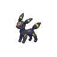

# Moor of icirrus

| Trainer             | 1                                                                                                     | 2                                                                                                 | 3                                                                                                   |
| ------------------- | ----------------------------------------------------------------------------------------------------- | ------------------------------------------------------------------------------------------------- | --------------------------------------------------------------------------------------------------- |
| Pkmn Ranger Harry   |   [Seismitoad](/blaze-black-wiki/pokemon/537)  Lv. 58 |   [Fraxure](/blaze-black-wiki/pokemon/611)  Lv. 58   |   [Umbreon](/blaze-black-wiki/pokemon/197)  Lv. 58     |
| Pkmn Ranger Chloris |   [Lilligant](/blaze-black-wiki/pokemon/549)  Lv. 58   |   [Swampert](/blaze-black-wiki/pokemon/260)  Lv. 58 |   [Porygon-z](/blaze-black-wiki/pokemon/474)  Lv. 58 |
| Fisherman Damon     |   [Stunfisk](/blaze-black-wiki/pokemon/618)  Lv. 57     |   [Seaking](/blaze-black-wiki/pokemon/119)  Lv. 57   |   [Kingdra](/blaze-black-wiki/pokemon/230)  Lv. 57     |
| Parasol Lady Miriah |   [Chandelure](/blaze-black-wiki/pokemon/609)  Lv. 58 |   [Vaporeon](/blaze-black-wiki/pokemon/134)  Lv. 58 |   [Golurk](/blaze-black-wiki/pokemon/623)  Lv. 58       |