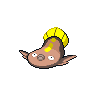
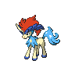

# Moor of icirrus

| Area                                                                             | Pokemon                                                                                    | &nbsp;                                                                            | &nbsp;                                                                          | &nbsp;                                                                          | &nbsp;                                                                    | &nbsp;                                                                      |
| -------------------------------------------------------------------------------- | ------------------------------------------------------------------------------------------ | --------------------------------------------------------------------------------- | ------------------------------------------------------------------------------- | ------------------------------------------------------------------------------- | ------------------------------------------------------------------------- | --------------------------------------------------------------------------- |
|  puddle-normal        |   [Quagsire](/pokemon/195)  20%              |   [Stunfisk](/pokemon/618)  20%     |   [Gastrodon](/pokemon/423)  10% |   [Toxicroak](/pokemon/454)  10% |   [Swalot](/pokemon/317)  10% |   [Weezing](/pokemon/110)  10% |
|                                                                                  |   [Muk](/pokemon/089)  10%                        |   [Palpitoad](/pokemon/536)  10%   |
|  surf-normal              |   [Stunfisk](/pokemon/618)  60%              |   [Barboach](/pokemon/339)  40%     |
|  surf-special           |   [Whiscash](/pokemon/340)  60%              |   [Seismitoad](/pokemon/537)  40% |
|  fishing-normal     |   [Barboach](/pokemon/339)  70%              |   [Stunfisk](/pokemon/618)  30%     |
|  fishing-special  |   [Barboach](/pokemon/339)  60%              |   [Stunfisk](/pokemon/618)  30%     |   [Whiscash](/pokemon/340)  10%   |
| legendary-encounter puddle-normal                                            |   [Keldeo-ordinary](/pokemon/647)  1% |