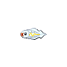
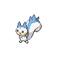

# Nimbasa city gym

| Trainer                                                                                        | 1                                                                                                   | 2                                                                                                     | 3                                                                                                 | 4                                                                                                   | 5                                                                                                     | 6                                                                                                   |
| ---------------------------------------------------------------------------------------------- | --------------------------------------------------------------------------------------------------- | ----------------------------------------------------------------------------------------------------- | ------------------------------------------------------------------------------------------------- | --------------------------------------------------------------------------------------------------- | ----------------------------------------------------------------------------------------------------- | --------------------------------------------------------------------------------------------------- |
| Lady Magnolia                                                                                  |   [Plusle](/blaze-black-wiki/pokemon/311)  Lv. 33       |   [Minun](/blaze-black-wiki/pokemon/312)  Lv. 33           |   [Joltik](/blaze-black-wiki/pokemon/595)  Lv. 33     |   [Tynamo](/blaze-black-wiki/pokemon/602)  Lv. 33       |   [Pichu](/blaze-black-wiki/pokemon/172)  Lv. 33           |
| Rich Boy Cody                                                                                  |   [Pachirisu](/blaze-black-wiki/pokemon/417)  Lv. 34 |   [Electabuzz](/blaze-black-wiki/pokemon/125)  Lv. 34 |   [Pikachu](/blaze-black-wiki/pokemon/025)  Lv. 34   |   [Flaaffy](/blaze-black-wiki/pokemon/180)  Lv. 34     |   [Jolteon](/blaze-black-wiki/pokemon/135)  Lv. 34       |
| Rich Boy Rolan                                                                                 |   [Luxray](/blaze-black-wiki/pokemon/405)  Lv. 34       |   [Jolteon](/blaze-black-wiki/pokemon/135)  Lv. 34       |   [Magneton](/blaze-black-wiki/pokemon/082)  Lv. 34 |   [Electrode](/blaze-black-wiki/pokemon/101)  Lv. 34 |   [Lanturn](/blaze-black-wiki/pokemon/171)  Lv. 34       |
| Lady Colette                                                                                   |   [Stunfisk](/blaze-black-wiki/pokemon/618)  Lv. 35   |   [Rotom](/blaze-black-wiki/pokemon/479)  Lv. 35           |   [Emolga](/blaze-black-wiki/pokemon/587)  Lv. 35     |
| Leader Elesa   |   [Emolga](/blaze-black-wiki/pokemon/587)  Lv. 36       |   [Manectric](/blaze-black-wiki/pokemon/310)  Lv. 36   |   [Ampharos](/blaze-black-wiki/pokemon/181)  Lv. 36 |   [Raichu](/blaze-black-wiki/pokemon/026)  Lv. 36       |   [Galvantula](/blaze-black-wiki/pokemon/596)  Lv. 36 |   [Zebstrika](/blaze-black-wiki/pokemon/523)  Lv. 38 |

## Leader Elesa

|                           | Item                                                                 | Nature | Ability       | Moves                                                                                      |
| ----------------------------------------------------------------------------------------------------- | -------------------------------------------------------------------- | ------ | ------------- | ------------------------------------------------------------------------------------------ |
|   [Emolga](/blaze-black-wiki/pokemon/587)  Lv. 36         | N/A                                                                  | N/A    | Static        | <ul><li>Wild-Charge</li><li>U-Turn</li><li>Acrobatics</li><li>Roost</li></ul>              |
|   [Manectric](/blaze-black-wiki/pokemon/310)  Lv. 36   | N/A                                                                  | N/A    | Static        | <ul><li>Thunderbolt</li><li>Volt-Switch</li><li>Flamethrower</li><li>Attract</li></ul>     |
|   [Ampharos](/blaze-black-wiki/pokemon/181)  Lv. 36     | N/A                                                                  | N/A    | Static        | <ul><li>Thunderbolt</li><li>Charge</li><li>Focus-Blast</li><li>Cotton-Guard</li></ul>      |
|   [Raichu](/blaze-black-wiki/pokemon/026)  Lv. 36         | N/A                                                                  | N/A    | Static        | <ul><li>Wild-Charge</li><li>Volt-Switch</li><li>Grass-Knot</li><li>Focus-Blast</li></ul>   |
|   [Galvantula](/blaze-black-wiki/pokemon/596)  Lv. 36 | N/A                                                                  | N/A    | Compound-Eyes | <ul><li>Thunder</li><li>Volt-Switch</li><li>Signal-Beam</li><li>Energy-Ball</li></ul>      |
|   [Zebstrika](/blaze-black-wiki/pokemon/523)  Lv. 38   |    Sitrus berry | N/A    | Sap-Sipper    | <ul><li>Wild-Charge</li><li>Volt-Switch</li><li>Flame-Charge</li><li>Double-Kick</li></ul> |