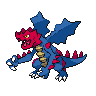
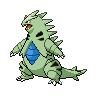
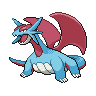

# Opelucid city gym

| Trainer                                                                                              | 1                                                                                  | 2                                                                                    | 3                                                                                    | 4                                                                                  | 5                                                                              | 6                                                                              |
| ---------------------------------------------------------------------------------------------------- | ---------------------------------------------------------------------------------- | ------------------------------------------------------------------------------------ | ------------------------------------------------------------------------------------ | ---------------------------------------------------------------------------------- | ------------------------------------------------------------------------------ | ------------------------------------------------------------------------------ |
| Ace Trainer Eileen                                                                                   |   [Vaporeon](/pokemon/134)  Lv. 63   |   [Jolteon](/pokemon/135)  Lv. 63       |   [Flareon](/pokemon/136)  Lv. 63       |
| Ace Trainer Lou                                                                                      |   [Hitmonlee](/pokemon/106)  Lv. 63 |   [Hitmonchan](/pokemon/107)  Lv. 63 |   [Hitmontop](/pokemon/237)  Lv. 63   |
| Ace Trainer Webster                                                                                  |   [Gyarados](/pokemon/130)  Lv. 58   |   [Dragonair](/pokemon/148)  Lv. 56   |   [Aerodactyl](/pokemon/142)  Lv. 60 |   [Dragonite](/pokemon/149)  Lv. 62 |
| Ace Trainer Olwen                                                                                    |   [Zweilous](/pokemon/634)  Lv. 62   |   [Druddigon](/pokemon/621)  Lv. 62   |   [Ampharos](/pokemon/181)  Lv. 62     |
| Ace Trainer Jose                                                                                     |   [Fraxure](/pokemon/611)  Lv. 62     |   [Gyarados](/pokemon/130)  Lv. 62     |   [Charizard](/pokemon/006)  Lv. 62   |
| Ace Trainer Clara                                                                                    |   [Milotic](/pokemon/350)  Lv. 62     |   [Dragonair](/pokemon/148)  Lv. 62   |   [Kangaskhan](/pokemon/115)  Lv. 62 |
| Veteran Hugo                                                                                         |   [Druddigon](/pokemon/621)  Lv. 63 |   [Flygon](/pokemon/330)  Lv. 63         |   [Garchomp](/pokemon/445)  Lv. 63     |
| Ace Trainer Tom                                                                                      |   [Steelix](/pokemon/208)  Lv. 62     |   [Tyranitar](/pokemon/248)  Lv. 62   |   [Altaria](/pokemon/334)  Lv. 62       |
| Ace Trainer Dara                                                                                     |   [Druddigon](/pokemon/621)  Lv. 63 |   [Zweilous](/pokemon/634)  Lv. 63     |   [Flygon](/pokemon/330)  Lv. 63         |
| Veteran Kim                                                                                          |   [Druddigon](/pokemon/621)  Lv. 63 |   [Altaria](/pokemon/334)  Lv. 63       |   [Salamence](/pokemon/373)  Lv. 63   |
| Leader Drayden   |   [Druddigon](/pokemon/621)  Lv. 64 |   [Charizard](/pokemon/006)  Lv. 64   |   [Flygon](/pokemon/330)  Lv. 64         |   [Salamence](/pokemon/373)  Lv. 64 |   [Kingdra](/pokemon/230)  Lv. 64 |   [Haxorus](/pokemon/612)  Lv. 66 |

## Leader Drayden

|    | Item                                                                 | Nature | Ability      | Moves                                                                                      |
| ---------------------------------------------------------------------------------- | -------------------------------------------------------------------- | ------ | ------------ | ------------------------------------------------------------------------------------------ |
|   [Druddigon](/pokemon/621)  Lv. 64 |    Rocky helmet | N/A    | Rough-Skin   | <ul><li>Outrage</li><li>Revenge</li><li>Earthquake</li><li>Dragon-Tail</li></ul>           |
|   [Charizard](/pokemon/006)  Lv. 64 |    Salac berry    | N/A    | Blaze        | <ul><li>Belly-Drum</li><li>Fire-Punch</li><li>Earthquake</li><li>Substitute</li></ul>      |
|   [Flygon](/pokemon/330)  Lv. 64       |    Yache berry    | N/A    | Levitate     | <ul><li>Quiver-Dance</li><li>Dragon-Pulse</li><li>Earth-Power</li><li>Fire-Blast</li></ul> |
|   [Salamence](/pokemon/373)  Lv. 64 |    Life orb             | N/A    | Moxie        | <ul><li>Outrage</li><li>Hydro-Pump</li><li>Brick-Break</li><li>Fire-Blast</li></ul>        |
|   [Kingdra](/pokemon/230)  Lv. 64     |    White herb       | N/A    | Sniper       | <ul><li>Draco-Meteor</li><li>Waterfall</li><li>Outrage</li><li>Frost-Breath</li></ul>      |
|   [Haxorus](/pokemon/612)  Lv. 66     |    Sitrus berry | N/A    | Mold-Breaker | <ul><li>Dragon-Dance</li><li>Outrage</li><li>Earthquake</li><li>Dragon-Tail</li></ul>      |