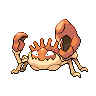

# P2 laboratory

| Area                                                                             | Pokemon                                                                           | &nbsp;                                                                          | &nbsp;                                                                          | &nbsp;                                                                          | &nbsp;                                                                      | &nbsp;                                                                      |
| -------------------------------------------------------------------------------- | --------------------------------------------------------------------------------- | ------------------------------------------------------------------------------- | ------------------------------------------------------------------------------- | ------------------------------------------------------------------------------- | --------------------------------------------------------------------------- | --------------------------------------------------------------------------- |
|  grass-normal           |   [Porygon](/pokemon/137)  20%       |   [Klang](/pokemon/600)  20%         |   [Magneton](/pokemon/082)  20%   |   [Electrode](/pokemon/101)  20% |   [Kingler](/pokemon/099)  10% |   [Shuckle](/pokemon/213)  10% |
|  grass-special        |   [Audino](/pokemon/531)  95%         |   [Porygon2](/pokemon/233)  5%    |
|  surf-normal              |   [Wingull](/pokemon/278)  60%       |   [Tentacool](/pokemon/072)  30% |   [Pelipper](/pokemon/279)  10%   |
|  surf-special           |   [Tentacruel](/pokemon/073)  60% |   [Frillish](/pokemon/592)  30%   |   [Jellicent](/pokemon/593)  10% |
|  fishing-normal     |   [Krabby](/pokemon/098)  60%         |   [Corphish](/pokemon/341)  40%   |
|  fishing-special  |   [Kingler](/pokemon/099)  60%       |   [Crawdaunt](/pokemon/342)  40% |