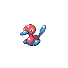
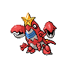

# P2 laboratory

| Area                                                                             | Pokemon                                                                                            | &nbsp;                                                                                           | &nbsp;                                                                                           | &nbsp;                                                                                           | &nbsp;                                                                                       | &nbsp;                                                                                       |
| -------------------------------------------------------------------------------- | -------------------------------------------------------------------------------------------------- | ------------------------------------------------------------------------------------------------ | ------------------------------------------------------------------------------------------------ | ------------------------------------------------------------------------------------------------ | -------------------------------------------------------------------------------------------- | -------------------------------------------------------------------------------------------- |
|  grass-normal           |   [Porygon](/blaze-black-wiki/pokemon/137)  20%       |   [Klang](/blaze-black-wiki/pokemon/600)  20%         |   [Magneton](/blaze-black-wiki/pokemon/082)  20%   |   [Electrode](/blaze-black-wiki/pokemon/101)  20% |   [Kingler](/blaze-black-wiki/pokemon/099)  10% |   [Shuckle](/blaze-black-wiki/pokemon/213)  10% |
|  grass-special        |   [Audino](/blaze-black-wiki/pokemon/531)  95%         |   [Porygon2](/blaze-black-wiki/pokemon/233)  5%    |
|  surf-normal              |   [Wingull](/blaze-black-wiki/pokemon/278)  60%       |   [Tentacool](/blaze-black-wiki/pokemon/072)  30% |   [Pelipper](/blaze-black-wiki/pokemon/279)  10%   |
|  surf-special           |   [Tentacruel](/blaze-black-wiki/pokemon/073)  60% |   [Frillish](/blaze-black-wiki/pokemon/592)  30%   |   [Jellicent](/blaze-black-wiki/pokemon/593)  10% |
|  fishing-normal     |   [Krabby](/blaze-black-wiki/pokemon/098)  60%         |   [Corphish](/blaze-black-wiki/pokemon/341)  40%   |
|  fishing-special  |   [Kingler](/blaze-black-wiki/pokemon/099)  60%       |   [Crawdaunt](/blaze-black-wiki/pokemon/342)  40% |