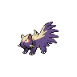
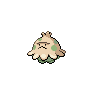
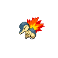

# Pinwheel forest - inside

| Trainer             | 1                                                                                                   | 2                                                                                                     | 3                                                                                                     | 4                                                                                                   |
| ------------------- | --------------------------------------------------------------------------------------------------- | ----------------------------------------------------------------------------------------------------- | ----------------------------------------------------------------------------------------------------- | --------------------------------------------------------------------------------------------------- |
| Twins Mayo & Mad D  |   [Sewaddle](/blaze-black-wiki/pokemon/540)  Lv. 20   |   [Venipede](/blaze-black-wiki/pokemon/543)  Lv. 20     |   [Cottonee](/blaze-black-wiki/pokemon/546)  Lv. 20     |   [Petilil](/blaze-black-wiki/pokemon/548)  Lv. 20     |
| Team Plasma Grunt 1 |   [Sandile](/blaze-black-wiki/pokemon/551)  Lv. 21     |   [Skorupi](/blaze-black-wiki/pokemon/451)  Lv. 21       |   [Foongus](/blaze-black-wiki/pokemon/590)  Lv. 21       |
| Team Plasma Grunt 2 |   [Stunky](/blaze-black-wiki/pokemon/434)  Lv. 21       |   [Glameow](/blaze-black-wiki/pokemon/431)  Lv. 21       |   [Mightyena](/blaze-black-wiki/pokemon/262)  Lv. 21   |
| Plmn Ranger Forres  |   [Dunsparce](/blaze-black-wiki/pokemon/206)  Lv. 22 |   [Chimchar](/blaze-black-wiki/pokemon/390)  Lv. 22     |   [Heracross](/blaze-black-wiki/pokemon/214)  Lv. 22   |
| Youngster Nicholas  |   [Shroomish](/blaze-black-wiki/pokemon/285)  Lv. 21 |   [Cyndaquil](/blaze-black-wiki/pokemon/155)  Lv. 21   |   [Treecko](/blaze-black-wiki/pokemon/252)  Lv. 21       |
| Plmn Ranger Audra   |   [Tangela](/blaze-black-wiki/pokemon/114)  Lv. 22     |   [Bulbasaur](/blaze-black-wiki/pokemon/001)  Lv. 22   |   [Scyther](/blaze-black-wiki/pokemon/123)  Lv. 22       |
| Plmn Ranger Irene   |   [Roselia](/blaze-black-wiki/pokemon/315)  Lv. 22     |   [Chikorita](/blaze-black-wiki/pokemon/152)  Lv. 22   |   [Pinsir](/blaze-black-wiki/pokemon/127)  Lv. 22         |
| Team Plasma Grunt 3 |   [Murkrow](/blaze-black-wiki/pokemon/198)  Lv. 22     |   [Liepard](/blaze-black-wiki/pokemon/510)  Lv. 22       |
| Plmn Ranger Miguel  |   [Vigoroth](/blaze-black-wiki/pokemon/288)  Lv. 22   |   [Turtwig](/blaze-black-wiki/pokemon/387)  Lv. 22       |   [Mothim](/blaze-black-wiki/pokemon/414)  Lv. 22         |
| Team Plasma Grunt 4 |   [Golbat](/blaze-black-wiki/pokemon/042)  Lv. 23       |   [Scraggy](/blaze-black-wiki/pokemon/559)  Lv. 23       |   [Beedrill](/blaze-black-wiki/pokemon/015)  Lv. 23     |   [Carnivine](/blaze-black-wiki/pokemon/455)  Lv. 23 |
| School Kid Millie   |   [Tranquill](/blaze-black-wiki/pokemon/520)  Lv. 22 |   [Furret](/blaze-black-wiki/pokemon/162)  Lv. 22         |   [Ivysaur](/blaze-black-wiki/pokemon/002)  Lv. 22       |
| Lass Eva            |   [Oddish](/blaze-black-wiki/pokemon/043)  Lv. 22       |   [Bellsprout](/blaze-black-wiki/pokemon/069)  Lv. 22 |   [Pidgeotto](/blaze-black-wiki/pokemon/017)  Lv. 22   |   [Wartortle](/blaze-black-wiki/pokemon/008)  Lv. 22 |
| School Kid Sammy    |   [Linoone](/blaze-black-wiki/pokemon/264)  Lv. 22     |   [Noctowl](/blaze-black-wiki/pokemon/164)  Lv. 22       |   [Charmeleon](/blaze-black-wiki/pokemon/005)  Lv. 22 |   [Sandshrew](/blaze-black-wiki/pokemon/027)  Lv. 22 |