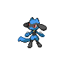
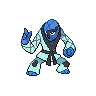

# Pinwheel forest - outside

| Trainer             | 1                                                                                                     | 2                                                                                                 | 3                                                                                                     | 4                                                                                           |
| ------------------- | ----------------------------------------------------------------------------------------------------- | ------------------------------------------------------------------------------------------------- | ----------------------------------------------------------------------------------------------------- | ------------------------------------------------------------------------------------------- |
| Nurse Shery         |   [Happiny](/blaze-black-wiki/pokemon/440)  Lv. 18       |   [Audino](/blaze-black-wiki/pokemon/531)  Lv. 18     |
| Preschooler Juliet  |   [Pansage](/blaze-black-wiki/pokemon/511)  Lv. 18       |   [Panpour](/blaze-black-wiki/pokemon/515)  Lv. 18   |   [Pansear](/blaze-black-wiki/pokemon/513)  Lv. 18       |
| Preschooler Homer   |   [Roggenrola](/blaze-black-wiki/pokemon/524)  Lv. 18 |   [Geodude](/blaze-black-wiki/pokemon/074)  Lv. 18   |   [Aron](/blaze-black-wiki/pokemon/304)  Lv. 18             |
| Youngster Keita     |   [Spinarak](/blaze-black-wiki/pokemon/167)  Lv. 18     |   [Doduo](/blaze-black-wiki/pokemon/084)  Lv. 18       |   [Charmander](/blaze-black-wiki/pokemon/004)  Lv. 18 |
| Youngster Zachary   |   [Burmy](/blaze-black-wiki/pokemon/412)  Lv. 18           |   [Torchic](/blaze-black-wiki/pokemon/255)  Lv. 18   |   [Ledyba](/blaze-black-wiki/pokemon/165)  Lv. 18         |
| Battle Girl Lee     |   [Timburr](/blaze-black-wiki/pokemon/532)  Lv. 18       |   [Croagunk](/blaze-black-wiki/pokemon/453)  Lv. 18 |   [Tyrogue](/blaze-black-wiki/pokemon/236)  Lv. 18       |   [Throh](/blaze-black-wiki/pokemon/538)  Lv. 18 |
| Battle Girl Kentaro |   [Machop](/blaze-black-wiki/pokemon/066)  Lv. 18         |   [Meditite](/blaze-black-wiki/pokemon/307)  Lv. 18 |   [Riolu](/blaze-black-wiki/pokemon/447)  Lv. 18           |   [Sawk](/blaze-black-wiki/pokemon/539)  Lv. 18   |