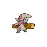
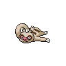
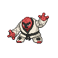

# Pinwheel forest - outside

| Area                                                                       | Pokemon                                                                       | &nbsp;                                                                       | &nbsp;                                                                          | &nbsp;                                                                        | &nbsp;                                                                           | &nbsp;                                                                         |
| -------------------------------------------------------------------------- | ----------------------------------------------------------------------------- | ---------------------------------------------------------------------------- | ------------------------------------------------------------------------------- | ----------------------------------------------------------------------------- | -------------------------------------------------------------------------------- | ------------------------------------------------------------------------------ |
|  grass-normal     |   [Tympole](/pokemon/535)  20%   |   [Timburr](/pokemon/532)  20%  |   [Meditite](/pokemon/307)  10%   |   [Spinarak](/pokemon/167)  10% |   [Ledyba](/pokemon/165)  10%        |   [Machop](/pokemon/066)  10%      |
|                                                                            |   [Makuhita](/pokemon/296)  10% |   [Croagunk](/pokemon/453)  5% |   [Slakoth](/pokemon/287)  5%      |
|  grass-doubles  |   [Throh](/pokemon/538)  20%       |   [Sawk](/pokemon/539)  20%        |   [Dunsparce](/pokemon/206)  10% |   [Doduo](/pokemon/084)  10%       |   [Snubbull](/pokemon/209)  10%    |   [Aipom](/pokemon/190)  10%        |
|                                                                            |   [Cubone](/pokemon/104)  9%      |   [Burmy](/pokemon/412)  9%       |   [Heracross](/pokemon/214)  2%  |
|  grass-special  |   [Audino](/pokemon/531)  20%     |   [Tepig](/pokemon/498)  10%      |   [Tyrogue](/pokemon/236)  10%     |   [Riolu](/pokemon/447)  10%       |   [Charmander](/pokemon/004)  5% |   [Cyndaquil](/pokemon/155)  5% |
|                                                                            |   [Torchic](/pokemon/255)  5%    |   [Chimchar](/pokemon/390)  5% |