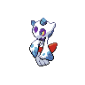
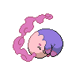
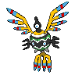
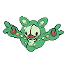
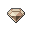

# Pokemon league

| Trainer                                                                                                               | 1                                                                                | 2                                                                                  | 3                                                                                    | 4                                                                                    | 5                                                                                    | 6                                                                                    |
| --------------------------------------------------------------------------------------------------------------------- | -------------------------------------------------------------------------------- | ---------------------------------------------------------------------------------- | ------------------------------------------------------------------------------------ | ------------------------------------------------------------------------------------ | ------------------------------------------------------------------------------------ | ------------------------------------------------------------------------------------ |
| Elite Four Shauntal         |   [Drifblim](/pokemon/426)  Lv. 71 |   [Golurk](/pokemon/623)  Lv. 71       |   [Mismagius](/pokemon/429)  Lv. 71   |   [Froslass](/pokemon/478)  Lv. 71     |   [Jellicent](/pokemon/593)  Lv. 73   |   [Chandelure](/pokemon/609)  Lv. 73 |
| Elite Four Grimsley         |   [Sharpedo](/pokemon/319)  Lv. 71 |   [Liepard](/pokemon/510)  Lv. 71     |   [Honchkrow](/pokemon/430)  Lv. 71   |   [Absol](/pokemon/359)  Lv. 71           |   [Houndoom](/pokemon/229)  Lv. 73     |   [Bisharp](/pokemon/625)  Lv. 73       |
| Elite Four Marshal            |   [Throh](/pokemon/538)  Lv. 71       |   [Sawk](/pokemon/539)  Lv. 71           |   [Breloom](/pokemon/286)  Lv. 71       |   [Poliwrath](/pokemon/062)  Lv. 71   |   [Mienshao](/pokemon/620)  Lv. 73     |   [Conkeldurr](/pokemon/534)  Lv. 73 |
| Elite Four Caitlin            |   [Musharna](/pokemon/518)  Lv. 71 |   [Sigilyph](/pokemon/561)  Lv. 71   |   [Beheeyem](/pokemon/606)  Lv. 71     |   [Bronzong](/pokemon/437)  Lv. 71     |   [Gothitelle](/pokemon/576)  Lv. 73 |   [Reuniclus](/pokemon/579)  Lv. 73   |
| Pkmn Trainer N                          |   [Zoroark](/pokemon/571)  Lv. 73   |   [Magmortar](/pokemon/467)  Lv. 73 |   [Slowbro](/pokemon/080)  Lv. 73       |   [Aerodactyl](/pokemon/142)  Lv. 73 |   [Porygon-z](/pokemon/474)  Lv. 73   |   [Zekrom](/pokemon/644)  Lv. 75         |
| Team Plasma Ghetsis   |   [Drapion](/pokemon/452)  Lv. 75   |   [Dusknoir](/pokemon/477)  Lv. 75   |   [Eelektross](/pokemon/604)  Lv. 75 |   [Gyarados](/pokemon/130)  Lv. 75     |   [Genesect](/pokemon/649)  Lv. 75     |   [Hydreigon](/pokemon/635)  Lv. 77   |

## Elite Four Shauntal

|  | Item                                                                       | Nature | Ability     | Moves                                                                                    |
| -------------------------------------------------------------------------------------- | -------------------------------------------------------------------------- | ------ | ----------- | ---------------------------------------------------------------------------------------- |
|   [Drifblim](/pokemon/426)  Lv. 71       |    Flame orb                | N/A    | Flare-Boost | <ul><li>Tailwind</li><li>Shadow-Ball</li><li>Thunderbolt</li><li>Hurricane</li></ul>     |
|   [Golurk](/pokemon/623)  Lv. 71           |    Soft sand                | N/A    | Iron-Fist   | <ul><li>Earthquake</li><li>Shadow-Punch</li><li>Hammer-Arm</li><li>Rock-Polish</li></ul> |
|   [Mismagius](/pokemon/429)  Lv. 71     |    Spell tag                | N/A    | Levitate    | <ul><li>Shadow-Ball</li><li>Nasty-Plot</li><li>Thunderbolt</li><li>Will-O-Wisp</li></ul> |
|   [Froslass](/pokemon/478)  Lv. 71       |    Never melt ice | N/A    | Levitate    | <ul><li>Shadow-Ball</li><li>Blizzard</li><li>Thunderbolt</li><li>Will-O-Wisp</li></ul>   |
|   [Jellicent](/pokemon/593)  Lv. 73     |    Mystic water       | N/A    | Cursed-Body | <ul><li>Shadow-Ball</li><li>Hydro-Pump</li><li>Will-O-Wisp</li><li>Recover</li></ul>     |
|   [Chandelure](/pokemon/609)  Lv. 73   |    Charcoal                   | N/A    | Levitate    | <ul><li>Shadow-Ball</li><li>Fire-Blast</li><li>Energy-Ball</li><li>Psychic</li></ul>     |

## Elite Four Grimsley

|  | Item                                                                    | Nature | Ability     | Moves                                                                                     |
| -------------------------------------------------------------------------------------- | ----------------------------------------------------------------------- | ------ | ----------- | ----------------------------------------------------------------------------------------- |
|   [Sharpedo](/pokemon/319)  Lv. 71       |    Rocky helmet    | N/A    | Speed-Boost | <ul><li>Protect</li><li>Crunch</li><li>Aqua-Jet</li><li>Hydro-Pump</li></ul>              |
|   [Liepard](/pokemon/510)  Lv. 71         |    Liechi berry    | N/A    | Prankster   | <ul><li>Thunder-Wave</li><li>Sucker-Punch</li><li>Charm</li><li>Wild-Charge</li></ul>     |
|   [Honchkrow](/pokemon/430)  Lv. 71     |    Scope lens          | N/A    | Moxie       | <ul><li>Thunder-Wave</li><li>Brave-Bird</li><li>Sucker-Punch</li><li>Heat-Wave</li></ul>  |
|   [Absol](/pokemon/359)  Lv. 71             |    Scope lens          | N/A    | Super-Luck  | <ul><li>Megahorn</li><li>Night-Slash</li><li>Psycho-Cut</li><li>Perish-Song</li></ul>     |
|   [Houndoom](/pokemon/229)  Lv. 73       |    Focus sash          | N/A    | Intimidate  | <ul><li>Dark-Pulse</li><li>Fire-Blast</li><li>Sucker-Punch</li><li>Hidden-Power</li></ul> |
|   [Bisharp](/pokemon/625)  Lv. 73         |    Black glasses | N/A    | Defiant     | <ul><li>Sucker-Punch</li><li>X-Scissor</li><li>Leaf-Blade</li><li>Stone-Edge</li></ul>    |

## Elite Four Marshal

|  | Item                                                                 | Nature | Ability      | Moves                                                                                 |
| ------------------------------------------------------------------------------------ | -------------------------------------------------------------------- | ------ | ------------ | ------------------------------------------------------------------------------------- |
|   [Throh](/pokemon/538)  Lv. 71           |    Flame orb          | N/A    | Guts         | <ul><li>Superpower</li><li>Facade</li><li>Fling</li><li>Rock-Slide</li></ul>          |
|   [Sawk](/pokemon/539)  Lv. 71             |    Salac berry    | N/A    | Sturdy       | <ul><li>Close-Combat</li><li>Stone-Edge</li><li>Payback</li><li>Return</li></ul>      |
|   [Breloom](/pokemon/286)  Lv. 71       |    Focus sash       | N/A    | Technician   | <ul><li>Spore</li><li>Bullet-Seed</li><li>Drain-Punch</li><li>Mach-Punch</li></ul>    |
|   [Poliwrath](/pokemon/062)  Lv. 71   |    Wacan berry    | N/A    | Water-Absorb | <ul><li>Waterfall</li><li>Brick-Break</li><li>Icy-Wind</li><li>Vacuum-Wave</li></ul>  |
|   [Mienshao](/pokemon/620)  Lv. 73     |    Flying gem       | N/A    | Reckless     | <ul><li>Acrobatics</li><li>High-Jump-Kick</li><li>U-Turn</li><li>Stone-Edge</li></ul> |
|   [Conkeldurr](/pokemon/534)  Lv. 73 |    Chesto berry | N/A    | Iron-Fist    | <ul><li>Mach-Punch</li><li>Drain-Punch</li><li>Stone-Edge</li><li>Rest</li></ul>      |

## Elite Four Caitlin

|  | Item                                                                 | Nature | Ability      | Moves                                                                                |
| ------------------------------------------------------------------------------------ | -------------------------------------------------------------------- | ------ | ------------ | ------------------------------------------------------------------------------------ |
|   [Musharna](/pokemon/518)  Lv. 71     |    Light clay       | N/A    | Telepathy    | <ul><li>Trick-Room</li><li>Psyshock</li><li>Reflect</li><li>Light-Screen</li></ul>   |
|   [Sigilyph](/pokemon/561)  Lv. 71     |    Life orb             | N/A    | Magic-Guard  | <ul><li>Protect</li><li>Hurricane</li><li>Psychic</li><li>Ice-Beam</li></ul>         |
|   [Beheeyem](/pokemon/606)  Lv. 71     |    Wise glasses | N/A    | Analytic     | <ul><li>Trick-Room</li><li>Thunderbolt</li><li>Psychic</li><li>Energy-Ball</li></ul> |
|   [Bronzong](/pokemon/437)  Lv. 71     |    Chesto berry | N/A    | Levitate     | <ul><li>Trick-Room</li><li>Rest</li><li>Earthquake</li><li>Gyro-Ball</li></ul>       |
|   [Gothitelle](/pokemon/576)  Lv. 73 |    Sitrus berry | N/A    | Magic-Bounce | <ul><li>Trick-Room</li><li>Focus-Blast</li><li>Psychic</li><li>Thunderbolt</li></ul> |
|   [Reuniclus](/pokemon/579)  Lv. 73   |    Life orb             | N/A    | Magic-Guard  | <ul><li>Trick-Room</li><li>Thunder</li><li>Psychic</li><li>Energy-Ball</li></ul>     |

## Pkmn Trainer N

|            | Item                                                           | Nature | Ability      | Moves                                                                                     |
| ------------------------------------------------------------------------------------ | -------------------------------------------------------------- | ------ | ------------ | ----------------------------------------------------------------------------------------- |
|   [Zoroark](/pokemon/571)  Lv. 73       |    Dark gem       | N/A    | Illusion     | <ul><li>Night-Daze</li><li>Focus-Blast</li><li>Flamethrower</li><li>Grass-Knot</li></ul>  |
|   [Magmortar](/pokemon/467)  Lv. 73   |    Fire gem       | N/A    | Flash-Fire   | <ul><li>Thunderbolt</li><li>Focus-Blast</li><li>Nasty-Plot</li><li>Magma-Storm</li></ul>  |
|   [Slowbro](/pokemon/080)  Lv. 73       |    Water gem    | N/A    | Regenerator  | <ul><li>Surf</li><li>Psychic</li><li>Flamethrower</li><li>Slack-Off</li></ul>             |
|   [Aerodactyl](/pokemon/142)  Lv. 73 |    Rock gem       | N/A    | Rock-Head    | <ul><li>Earthquake</li><li>Thunder-Fang</li><li>Head-Smash</li><li>Dragon-Dance</li></ul> |
|   [Porygon-z](/pokemon/474)  Lv. 73   |    Normal gem | N/A    | Adaptability | <ul><li>Tri-Attack</li><li>Ice-Beam</li><li>Dark-Pulse</li><li>Thunderbolt</li></ul>      |
|   [Zekrom](/pokemon/644)  Lv. 75         |    Life orb       | N/A    | Teravolt     | <ul><li>Dragon-Claw</li><li>Bolt-Strike</li><li>Light-Screen</li><li>Hone-Claws</li></ul> |

## Team Plasma Ghetsis

|  | Item                                                                 | Nature | Ability     | Moves                                                                                       |
| -------------------------------------------------------------------------------------------- | -------------------------------------------------------------------- | ------ | ----------- | ------------------------------------------------------------------------------------------- |
|   [Drapion](/pokemon/452)  Lv. 75               |    Scope lens       | N/A    | Sniper      | <ul><li>Night-Slash</li><li>Cross-Poison</li><li>Storm-Throw</li><li>Toxic-Spikes</li></ul> |
|   [Dusknoir](/pokemon/477)  Lv. 75             |    Sitrus berry | N/A    | Cursed-Body | <ul><li>Payback</li><li>Will-O-Wisp</li><li>Pain-Split</li><li>Earthquake</li></ul>         |
|   [Eelektross](/pokemon/604)  Lv. 75         |    Flying gem       | N/A    | Levitate    | <ul><li>Acrobatics</li><li>Thunder</li><li>Flamethrower</li><li>Rock-Slide</li></ul>        |
|   [Gyarados](/pokemon/130)  Lv. 75             |    Life orb             | N/A    | Moxie       | <ul><li>Aqua-Tail</li><li>Dragon-Dance</li><li>Thunder-Wave</li><li>Earthquake</li></ul>    |
|   [Genesect](/pokemon/649)  Lv. 75             |    Focus sash       | N/A    | Download    | <ul><li>Bug-Buzz</li><li>Ice-Beam</li><li>Thunderbolt</li><li>Rock-Polish</li></ul>         |
|   [Hydreigon](/pokemon/635)  Lv. 77           |    White herb       | N/A    | Levitate    | <ul><li>Draco-Meteor</li><li>Fire-Blast</li><li>Focus-Blast</li><li>Dark-Pulse</li></ul>    |