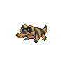

# Relic castle - 1f

| Area                                                                 | Pokemon                                                                     | &nbsp;                                                                          | &nbsp;                                                                      | &nbsp;                                                                  | &nbsp;                                                                    | &nbsp;                                                                      |
| -------------------------------------------------------------------- | --------------------------------------------------------------------------- | ------------------------------------------------------------------------------- | --------------------------------------------------------------------------- | ----------------------------------------------------------------------- | ------------------------------------------------------------------------- | --------------------------------------------------------------------------- |
|  sand-normal  |   [Sandile](/pokemon/551)  20% |   [Sandshrew](/pokemon/027)  20% |   [Rhyhorn](/pokemon/111)  10% |   [Numel](/pokemon/322)  10% |   [Golett](/pokemon/622)  10% |   [Bronzor](/pokemon/436)  10% |
|                                                                      |   [Onix](/pokemon/095)  10%       |   [Trapinch](/pokemon/328)  10%   |