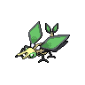

# Relic castle - b5f

| Area                                                                 | Pokemon                                                                       | &nbsp;                                                                            | &nbsp;                                                                                             | &nbsp;                                                                          | &nbsp;                                                                          | &nbsp;                                                                      |
| -------------------------------------------------------------------- | ----------------------------------------------------------------------------- | --------------------------------------------------------------------------------- | -------------------------------------------------------------------------------------------------- | ------------------------------------------------------------------------------- | ------------------------------------------------------------------------------- | --------------------------------------------------------------------------- |
|  sand-normal  |   [Krokorok](/pokemon/552)  20% |   [Cofagrigus](/pokemon/563)  20% |   [Vibrava](/pokemon/329)  10%                        |   [Hippowdon](/pokemon/450)  10% |   [Sandslash](/pokemon/028)  10% |   [Claydol](/pokemon/344)  10% |
|                                                                      |   [Sigilyph](/pokemon/561)  5%  |   [Crustle](/pokemon/558)  5%        |   [Darmanitan-standard](/pokemon/555)  5% |   [Camerupt](/pokemon/323)  5%    |
| legendary-encounter                                              |   [Regirock](/pokemon/377)  1%  |   [Regice](/pokemon/378)  1%          |   [Registeel](/pokemon/379)  1%                     |