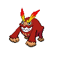
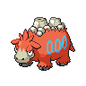

# Relic castle - maze

| Area                                                                 | Pokemon                                                                                        | &nbsp;                                                                                             | &nbsp;                                                                                                              | &nbsp;                                                                                           | &nbsp;                                                                                           | &nbsp;                                                                                       |
| -------------------------------------------------------------------- | ---------------------------------------------------------------------------------------------- | -------------------------------------------------------------------------------------------------- | ------------------------------------------------------------------------------------------------------------------- | ------------------------------------------------------------------------------------------------ | ------------------------------------------------------------------------------------------------ | -------------------------------------------------------------------------------------------- |
|  sand-normal  |   [Krokorok](/blaze-black-wiki/pokemon/552)  20% |   [Cofagrigus](/blaze-black-wiki/pokemon/563)  20% |   [Vibrava](/blaze-black-wiki/pokemon/329)  10%                        |   [Hippowdon](/blaze-black-wiki/pokemon/450)  10% |   [Sandslash](/blaze-black-wiki/pokemon/028)  10% |   [Claydol](/blaze-black-wiki/pokemon/344)  10% |
|                                                                      |   [Sigilyph](/blaze-black-wiki/pokemon/561)  5%  |   [Crustle](/blaze-black-wiki/pokemon/558)  5%        |   [Darmanitan-standard](/blaze-black-wiki/pokemon/555)  5% |   [Camerupt](/blaze-black-wiki/pokemon/323)  5%    |