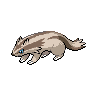

# Route 1

| Area                                                                             | Pokemon                                                                                               | &nbsp;                                                                          | &nbsp;                                                                       | &nbsp;                                                                      | &nbsp;                                                                        | &nbsp;                                                                          |
| -------------------------------------------------------------------------------- | ----------------------------------------------------------------------------------------------------- | ------------------------------------------------------------------------------- | ---------------------------------------------------------------------------- | --------------------------------------------------------------------------- | ----------------------------------------------------------------------------- | ------------------------------------------------------------------------------- |
|  grass-normal lv.       |   [Lillipup](/pokemon/506)  20%                         |   [Pidgey](/pokemon/016)  20%       |   [Bidoof](/pokemon/399)  10%    |   [Sentret](/pokemon/161)  10% |   [Rattata](/pokemon/019)  10%   |   [Zigzagoon](/pokemon/263)  10% |
|                                                                                  |   [Starly](/pokemon/396)  10%                             |   [Hoothoot](/pokemon/163)  10%   |
|  grass-doubles        |   [Herdier](/pokemon/507)  20%                           |   [Watchog](/pokemon/505)  20%     |   [Bibarel](/pokemon/400)  10%  |   [Furret](/pokemon/162)  10%   |   [Raticate](/pokemon/020)  10% |   [Linoone](/pokemon/264)  10%     |
|                                                                                  |   [Mightyena](/pokemon/262)  5%                        |   [Pidgeotto](/pokemon/017)  5%  |   [Staravia](/pokemon/397)  5% |   [Noctowl](/pokemon/164)  5%  |
|  grass-special        |   [Audino](/pokemon/531)  80%                             |   [Happiny](/pokemon/440)  10%     |   [Azurill](/pokemon/298)  10%  |
|  surf-normal              |   [Basculin-red-striped](/pokemon/550)  60% |   [Marill](/pokemon/183)  30%       |   [Feebas](/pokemon/349)  10%    |
|  surf-special           |   [Basculin-red-striped](/pokemon/550)  60% |   [Azumarill](/pokemon/184)  30% |   [Feebas](/pokemon/349)  10%    |
|  fishing-normal     |   [Goldeen](/pokemon/118)  60%                           |   [Magikarp](/pokemon/129)  30%   |   [Feebas](/pokemon/349)  10%    |
|  fishing-special  |   [Basculin-red-striped](/pokemon/550)  60% |   [Dratini](/pokemon/147)  30%     |   [Gyarados](/pokemon/130)  5% |   [Milotic](/pokemon/350)  5%  |