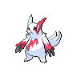

# Route 10 - league path

| Area                                                                       | Pokemon                                                                       | &nbsp;                                                                          | &nbsp;                                                                        | &nbsp;                                                                    | &nbsp;                                                                          | &nbsp;                                                                        |
| -------------------------------------------------------------------------- | ----------------------------------------------------------------------------- | ------------------------------------------------------------------------------- | ----------------------------------------------------------------------------- | ------------------------------------------------------------------------- | ------------------------------------------------------------------------------- | ----------------------------------------------------------------------------- |
|  grass-normal     |   [Linoone](/pokemon/264)  20%   |   [Bibarel](/pokemon/400)  20%     |   [Skiploom](/pokemon/188)  10% |   [Arbok](/pokemon/024)  10%   |   [Sandslash](/pokemon/028)  10% |   [Dodrio](/pokemon/085)  10%     |
|                                                                            |   [Zangoose](/pokemon/335)  10% |   [Seviper](/pokemon/336)  10%     |
|  grass-doubles  |   [Scyther](/pokemon/123)  20%   |   [Pinsir](/pokemon/127)  20%       |   [Cherrim](/pokemon/421)  10%   |   [Fearow](/pokemon/022)  10% |   [Herdier](/pokemon/507)  10%     |   [Rapidash](/pokemon/078)  10% |
|                                                                            |   [Tropius](/pokemon/357)  10%   |   [Girafarig](/pokemon/203)  10% |
|  grass-special  |   [Chansey](/pokemon/113)  90%   |   [Blissey](/pokemon/242)  90%     |
| legendary-encounter grass-doubles                                      |   [Latias](/pokemon/380)  1%      |   [Latios](/pokemon/381)  1%        |