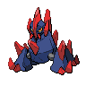
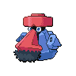
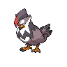

# Route 10 - main route

| Trainer              | 1                                                                                                   | 2                                                                                                     | 3                                                                                                     | 4                                                                                                     | 5                                                                                                   |
| -------------------- | --------------------------------------------------------------------------------------------------- | ----------------------------------------------------------------------------------------------------- | ----------------------------------------------------------------------------------------------------- | ----------------------------------------------------------------------------------------------------- | --------------------------------------------------------------------------------------------------- |
| Battle Girl Amy      |   [Machamp](/blaze-black-wiki/pokemon/068)  Lv. 60     |   [Lucario](/blaze-black-wiki/pokemon/448)  Lv. 60       |   [Conkeldurr](/blaze-black-wiki/pokemon/534)  Lv. 60 |   [Infernape](/blaze-black-wiki/pokemon/392)  Lv. 60   |
| Ace Trainer Johan    |   [Tangrowth](/blaze-black-wiki/pokemon/465)  Lv. 63 |   [Ampharos](/blaze-black-wiki/pokemon/181)  Lv. 63     |   [Magmortar](/blaze-black-wiki/pokemon/467)  Lv. 63   |   [Scizor](/blaze-black-wiki/pokemon/212)  Lv. 63         |
| Veteran Karla        |   [Reuniclus](/blaze-black-wiki/pokemon/579)  Lv. 63 |   [Rhyperior](/blaze-black-wiki/pokemon/464)  Lv. 63   |   [Beartic](/blaze-black-wiki/pokemon/614)  Lv. 63       |   [Escavalier](/blaze-black-wiki/pokemon/589)  Lv. 63 |   [Ninetales](/blaze-black-wiki/pokemon/038)  Lv. 63 |
| Black Belt Corey     |   [Throh](/blaze-black-wiki/pokemon/538)  Lv. 60         |   [Sawk](/blaze-black-wiki/pokemon/539)  Lv. 60             |
| Hiker Bret           |   [Gigalith](/blaze-black-wiki/pokemon/526)  Lv. 60   |   [Conkeldurr](/blaze-black-wiki/pokemon/534)  Lv. 60 |   [Probopass](/blaze-black-wiki/pokemon/476)  Lv. 60   |
| Ace Trainer Cheyenne |   [Togekiss](/blaze-black-wiki/pokemon/468)  Lv. 63   |   [Gyarados](/blaze-black-wiki/pokemon/130)  Lv. 63     |   [Vanilluxe](/blaze-black-wiki/pokemon/584)  Lv. 63   |   [Galvantula](/blaze-black-wiki/pokemon/596)  Lv. 63 |   [Porygon-z](/blaze-black-wiki/pokemon/474)  Lv. 63 |
| Veteran Chester      |   [Samurott](/blaze-black-wiki/pokemon/503)  Lv. 63   |   [Hippowdon](/blaze-black-wiki/pokemon/450)  Lv. 63   |   [Exeggutor](/blaze-black-wiki/pokemon/103)  Lv. 63   |   [Skarmory](/blaze-black-wiki/pokemon/227)  Lv. 63     |   [Luxray](/blaze-black-wiki/pokemon/405)  Lv. 63       |

=== "Fire"

    | Trainer                                                                             | 1                                                                                                   | 2                                                                                                 | 3                                                                                                 | 4                                                                                                     | 5                                                                                                 | 6                                                                                                 |
    | ----------------------------------------------------------------------------------- | --------------------------------------------------------------------------------------------------- | ------------------------------------------------------------------------------------------------- | ------------------------------------------------------------------------------------------------- | ----------------------------------------------------------------------------------------------------- | ------------------------------------------------------------------------------------------------- | ------------------------------------------------------------------------------------------------- |
    | Cheren   |   [Staraptor](/blaze-black-wiki/pokemon/398)  Lv. 66 |   [Gigalith](/blaze-black-wiki/pokemon/526)  Lv. 66 |   [Alakazam](/blaze-black-wiki/pokemon/065)  Lv. 66 |   [Whimsicott](/blaze-black-wiki/pokemon/547)  Lv. 66 |   [Simisear](/blaze-black-wiki/pokemon/514)  Lv. 66 |   [Samurott](/blaze-black-wiki/pokemon/503)  Lv. 68 |

=== "Water"

    | Trainer                                                                             | 1                                                                                                   | 2                                                                                                 | 3                                                                                                 | 4                                                                                                 | 5                                                                                                 | 6                                                                                                   |
    | ----------------------------------------------------------------------------------- | --------------------------------------------------------------------------------------------------- | ------------------------------------------------------------------------------------------------- | ------------------------------------------------------------------------------------------------- | ------------------------------------------------------------------------------------------------- | ------------------------------------------------------------------------------------------------- | --------------------------------------------------------------------------------------------------- |
    | Cheren   |   [Staraptor](/blaze-black-wiki/pokemon/398)  Lv. 66 |   [Gigalith](/blaze-black-wiki/pokemon/526)  Lv. 66 |   [Alakazam](/blaze-black-wiki/pokemon/065)  Lv. 66 |   [Houndoom](/blaze-black-wiki/pokemon/229)  Lv. 66 |   [Simipour](/blaze-black-wiki/pokemon/516)  Lv. 66 |   [Serperior](/blaze-black-wiki/pokemon/497)  Lv. 68 |

=== "Grass"

    | Trainer                                                                             | 1                                                                                                   | 2                                                                                                 | 3                                                                                                 | 4                                                                                                 | 5                                                                                                 | 6                                                                                             |
    | ----------------------------------------------------------------------------------- | --------------------------------------------------------------------------------------------------- | ------------------------------------------------------------------------------------------------- | ------------------------------------------------------------------------------------------------- | ------------------------------------------------------------------------------------------------- | ------------------------------------------------------------------------------------------------- | --------------------------------------------------------------------------------------------- |
    | Cheren   |   [Staraptor](/blaze-black-wiki/pokemon/398)  Lv. 66 |   [Gigalith](/blaze-black-wiki/pokemon/526)  Lv. 66 |   [Alakazam](/blaze-black-wiki/pokemon/065)  Lv. 66 |   [Gyarados](/blaze-black-wiki/pokemon/130)  Lv. 66 |   [Simisage](/blaze-black-wiki/pokemon/512)  Lv. 66 |   [Emboar](/blaze-black-wiki/pokemon/500)  Lv. 68 |

 

## Cheren

=== "Fire"

    |                                | Item | Nature | Ability | Moves                                                     |
    | ----------------------------------------------------------------------------------------------------- | ---- | ------ | ------- | --------------------------------------------------------- |
    |   [Staraptor](/blaze-black-wiki/pokemon/398)  Lv. 66   | N/A  | N/A    | N/A     | <ul><li>N/A</li><li>N/A</li><li>N/A</li><li>N/A</li></ul> |
    |   [Gigalith](/blaze-black-wiki/pokemon/526)  Lv. 66     | N/A  | N/A    | N/A     | <ul><li>N/A</li><li>N/A</li><li>N/A</li><li>N/A</li></ul> |
    |   [Alakazam](/blaze-black-wiki/pokemon/065)  Lv. 66     | N/A  | N/A    | N/A     | <ul><li>N/A</li><li>N/A</li><li>N/A</li><li>N/A</li></ul> |
    |   [Whimsicott](/blaze-black-wiki/pokemon/547)  Lv. 66 | N/A  | N/A    | N/A     | <ul><li>N/A</li><li>N/A</li><li>N/A</li><li>N/A</li></ul> |
    |   [Simisear](/blaze-black-wiki/pokemon/514)  Lv. 66     | N/A  | N/A    | N/A     | <ul><li>N/A</li><li>N/A</li><li>N/A</li><li>N/A</li></ul> |
    |   [Samurott](/blaze-black-wiki/pokemon/503)  Lv. 68     | N/A  | N/A    | N/A     | <ul><li>N/A</li><li>N/A</li><li>N/A</li><li>N/A</li></ul> |

=== "Water"

    |                              | Item | Nature | Ability | Moves                                                     |
    | --------------------------------------------------------------------------------------------------- | ---- | ------ | ------- | --------------------------------------------------------- |
    |   [Staraptor](/blaze-black-wiki/pokemon/398)  Lv. 66 | N/A  | N/A    | N/A     | <ul><li>N/A</li><li>N/A</li><li>N/A</li><li>N/A</li></ul> |
    |   [Gigalith](/blaze-black-wiki/pokemon/526)  Lv. 66   | N/A  | N/A    | N/A     | <ul><li>N/A</li><li>N/A</li><li>N/A</li><li>N/A</li></ul> |
    |   [Alakazam](/blaze-black-wiki/pokemon/065)  Lv. 66   | N/A  | N/A    | N/A     | <ul><li>N/A</li><li>N/A</li><li>N/A</li><li>N/A</li></ul> |
    |   [Houndoom](/blaze-black-wiki/pokemon/229)  Lv. 66   | N/A  | N/A    | N/A     | <ul><li>N/A</li><li>N/A</li><li>N/A</li><li>N/A</li></ul> |
    |   [Simipour](/blaze-black-wiki/pokemon/516)  Lv. 66   | N/A  | N/A    | N/A     | <ul><li>N/A</li><li>N/A</li><li>N/A</li><li>N/A</li></ul> |
    |   [Serperior](/blaze-black-wiki/pokemon/497)  Lv. 68 | N/A  | N/A    | N/A     | <ul><li>N/A</li><li>N/A</li><li>N/A</li><li>N/A</li></ul> |

=== "Grass"

    |                              | Item | Nature | Ability | Moves                                                     |
    | --------------------------------------------------------------------------------------------------- | ---- | ------ | ------- | --------------------------------------------------------- |
    |   [Staraptor](/blaze-black-wiki/pokemon/398)  Lv. 66 | N/A  | N/A    | N/A     | <ul><li>N/A</li><li>N/A</li><li>N/A</li><li>N/A</li></ul> |
    |   [Gigalith](/blaze-black-wiki/pokemon/526)  Lv. 66   | N/A  | N/A    | N/A     | <ul><li>N/A</li><li>N/A</li><li>N/A</li><li>N/A</li></ul> |
    |   [Alakazam](/blaze-black-wiki/pokemon/065)  Lv. 66   | N/A  | N/A    | N/A     | <ul><li>N/A</li><li>N/A</li><li>N/A</li><li>N/A</li></ul> |
    |   [Gyarados](/blaze-black-wiki/pokemon/130)  Lv. 66   | N/A  | N/A    | N/A     | <ul><li>N/A</li><li>N/A</li><li>N/A</li><li>N/A</li></ul> |
    |   [Simisage](/blaze-black-wiki/pokemon/512)  Lv. 66   | N/A  | N/A    | N/A     | <ul><li>N/A</li><li>N/A</li><li>N/A</li><li>N/A</li></ul> |
    |   [Emboar](/blaze-black-wiki/pokemon/500)  Lv. 68       | N/A  | N/A    | N/A     | <ul><li>N/A</li><li>N/A</li><li>N/A</li><li>N/A</li></ul> |