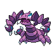

# Route 10 - main route

| Area                                                                       | Pokemon                                                                                                           | &nbsp;                                                                                                              | &nbsp;                                                                                             | &nbsp;                                                                                       | &nbsp;                                                                                       | &nbsp;                                                                                         |
| -------------------------------------------------------------------------- | ----------------------------------------------------------------------------------------------------------------- | ------------------------------------------------------------------------------------------------------------------- | -------------------------------------------------------------------------------------------------- | -------------------------------------------------------------------------------------------- | -------------------------------------------------------------------------------------------- | ---------------------------------------------------------------------------------------------- |
|  grass-normal     |   [Herdier](/blaze-black-wiki/pokemon/507)  20%                      |   [Pidgeotto](/blaze-black-wiki/pokemon/017)  20%                    |   [Rufflet](/blaze-black-wiki/pokemon/627)  10%       |   [Vullaby](/blaze-black-wiki/pokemon/629)  10% |   [Machoke](/blaze-black-wiki/pokemon/067)  10% |   [Primeape](/blaze-black-wiki/pokemon/057)  10% |
|                                                                            |   [Amoonguss](/blaze-black-wiki/pokemon/591)  10%                  |   [Tranquill](/blaze-black-wiki/pokemon/520)  10%                    |
|  grass-doubles  |   [Mandibuzz](/blaze-black-wiki/pokemon/630)  20%                  |   [Braviary](/blaze-black-wiki/pokemon/628)  20%                      |   [Bouffalant](/blaze-black-wiki/pokemon/626)  10% |   [Grumpig](/blaze-black-wiki/pokemon/326)  10% |   [Drapion](/blaze-black-wiki/pokemon/452)  10% |   [Scrafty](/blaze-black-wiki/pokemon/560)  10%   |
|                                                                            |   [Heracross](/blaze-black-wiki/pokemon/214)  10%                  |   [Manectric](/blaze-black-wiki/pokemon/310)  10%                    |
|  grass-special  |   [Audino](/blaze-black-wiki/pokemon/531)  100%                       |
| legendary-encounter grass-special                                      |   [Tornadus-incarnate](/blaze-black-wiki/pokemon/641)  1% |   [Thundurus-incarnate](/blaze-black-wiki/pokemon/642)  1% |