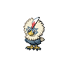

# Route 10 - main route

| Area                                                                       | Pokemon                                                                                          | &nbsp;                                                                                             | &nbsp;                                                                            | &nbsp;                                                                      | &nbsp;                                                                      | &nbsp;                                                                        |
| -------------------------------------------------------------------------- | ------------------------------------------------------------------------------------------------ | -------------------------------------------------------------------------------------------------- | --------------------------------------------------------------------------------- | --------------------------------------------------------------------------- | --------------------------------------------------------------------------- | ----------------------------------------------------------------------------- |
|  grass-normal     |   [Herdier](/pokemon/507)  20%                      |   [Pidgeotto](/pokemon/017)  20%                    |   [Rufflet](/pokemon/627)  10%       |   [Vullaby](/pokemon/629)  10% |   [Machoke](/pokemon/067)  10% |   [Primeape](/pokemon/057)  10% |
|                                                                            |   [Amoonguss](/pokemon/591)  10%                  |   [Tranquill](/pokemon/520)  10%                    |
|  grass-doubles  |   [Mandibuzz](/pokemon/630)  20%                  |   [Braviary](/pokemon/628)  20%                      |   [Bouffalant](/pokemon/626)  10% |   [Grumpig](/pokemon/326)  10% |   [Drapion](/pokemon/452)  10% |   [Scrafty](/pokemon/560)  10%   |
|                                                                            |   [Heracross](/pokemon/214)  10%                  |   [Manectric](/pokemon/310)  10%                    |
|  grass-special  |   [Audino](/pokemon/531)  100%                       |
| legendary-encounter grass-special                                      |   [Tornadus-incarnate](/pokemon/641)  1% |   [Thundurus-incarnate](/pokemon/642)  1% |