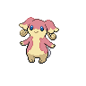
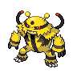

# Route 11

| Area                                                                          | Pokemon                                                                                      | &nbsp;                                                                                                                 | &nbsp;                                                                                            | &nbsp;                                                                                             | &nbsp;                                                                                      | &nbsp;                                                                                          |
| ----------------------------------------------------------------------------- | -------------------------------------------------------------------------------------------- | ---------------------------------------------------------------------------------------------------------------------- | ------------------------------------------------------------------------------------------------- | -------------------------------------------------------------------------------------------------- | ------------------------------------------------------------------------------------------- | ----------------------------------------------------------------------------------------------- |
|  grass-normal        |   [Golduck](/blaze-black-wiki/pokemon/055)  20% |   [Bisharp](/blaze-black-wiki/pokemon/625)  20%                           |   [Mandibuzz](/blaze-black-wiki/pokemon/630)  10%  |   [Braviary](/blaze-black-wiki/pokemon/628)  10%     |   [Gligar](/blaze-black-wiki/pokemon/207)  10%  |   [Marowak](/blaze-black-wiki/pokemon/105)  10%    |
|                                                                               |   [Purugly](/blaze-black-wiki/pokemon/432)  10% |   [Skuntank](/blaze-black-wiki/pokemon/435)  10%                         |
|  grass-doubles     |   [Loudred](/blaze-black-wiki/pokemon/294)  20% |   [Staravia](/blaze-black-wiki/pokemon/397)  20%                         |   [Vigoroth](/blaze-black-wiki/pokemon/288)  10%    |   [Electabuzz](/blaze-black-wiki/pokemon/125)  10% |   [Magmar](/blaze-black-wiki/pokemon/126)  10%  |   [Flygon](/blaze-black-wiki/pokemon/330)  10%      |
|                                                                               |   [Rhydon](/blaze-black-wiki/pokemon/112)  10%   |   [Boldore](/blaze-black-wiki/pokemon/525)  10%                           |
|  grass-special     |   [Audino](/blaze-black-wiki/pokemon/531)  70%   |   [Emolga](/blaze-black-wiki/pokemon/587)  10%                             |   [Electivire](/blaze-black-wiki/pokemon/466)  5% |   [Magmortar](/blaze-black-wiki/pokemon/467)  5%    |   [Gliscor](/blaze-black-wiki/pokemon/472)  5% |   [Staraptor](/blaze-black-wiki/pokemon/398)  5% |
|  surf-normal           |   [Buizel](/blaze-black-wiki/pokemon/418)  60%   |   [Floatzel](/blaze-black-wiki/pokemon/419)  40%                         |
|  surf-special        |   [Dratini](/blaze-black-wiki/pokemon/147)  60% |   [Dragonair](/blaze-black-wiki/pokemon/148)  35%                       |   [Dragonite](/blaze-black-wiki/pokemon/149)  5%   |
|  fishing-normal  |   [Goldeen](/blaze-black-wiki/pokemon/118)  60% |   [Basculin-red-striped](/blaze-black-wiki/pokemon/550)  30% |   [Seaking](/blaze-black-wiki/pokemon/119)  10%      |