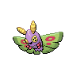

# Route 12

| Area                                                                       | Pokemon                                                                           | &nbsp;                                                                            | &nbsp;                                                                         | &nbsp;                                                                          | &nbsp;                                                                          | &nbsp;                                                                        |
| -------------------------------------------------------------------------- | --------------------------------------------------------------------------------- | --------------------------------------------------------------------------------- | ------------------------------------------------------------------------------ | ------------------------------------------------------------------------------- | ------------------------------------------------------------------------------- | ----------------------------------------------------------------------------- |
|  grass-normal     |   [Cherrim](/pokemon/421)  20%       |   [Combee](/pokemon/415)  20%         |   [Sunkern](/pokemon/191)  10%    |   [Pinsir](/pokemon/127)  10%       |   [Heracross](/pokemon/214)  10% |   [Scyther](/pokemon/123)  10%   |
|                                                                            |   [Rapidash](/pokemon/078)  10%     |   [Zebstrika](/pokemon/523)  10%   |
|  grass-doubles  |   [Tranquill](/pokemon/520)  40%   |   [Butterfree](/pokemon/012)  10% |   [Beedrill](/pokemon/015)  10%  |   [Beautifly](/pokemon/267)  10% |   [Dustox](/pokemon/269)  10%       |   [Swadloon](/pokemon/541)  10% |
|                                                                            |   [Whirlipede](/pokemon/544)  10% |
|  grass-special  |   [Emolga](/pokemon/587)  95%         |   [Sunflora](/pokemon/192)  5%      |   [Vespiquen](/pokemon/416)  5% |