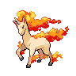

# Route 12

| Area                                                                       | Pokemon                                                                                            | &nbsp;                                                                                             | &nbsp;                                                                                          | &nbsp;                                                                                           | &nbsp;                                                                                           | &nbsp;                                                                                         |
| -------------------------------------------------------------------------- | -------------------------------------------------------------------------------------------------- | -------------------------------------------------------------------------------------------------- | ----------------------------------------------------------------------------------------------- | ------------------------------------------------------------------------------------------------ | ------------------------------------------------------------------------------------------------ | ---------------------------------------------------------------------------------------------- |
|  grass-normal     |   [Cherrim](/blaze-black-wiki/pokemon/421)  20%       |   [Combee](/blaze-black-wiki/pokemon/415)  20%         |   [Sunkern](/blaze-black-wiki/pokemon/191)  10%    |   [Pinsir](/blaze-black-wiki/pokemon/127)  10%       |   [Heracross](/blaze-black-wiki/pokemon/214)  10% |   [Scyther](/blaze-black-wiki/pokemon/123)  10%   |
|                                                                            |   [Rapidash](/blaze-black-wiki/pokemon/078)  10%     |   [Zebstrika](/blaze-black-wiki/pokemon/523)  10%   |
|  grass-doubles  |   [Tranquill](/blaze-black-wiki/pokemon/520)  40%   |   [Butterfree](/blaze-black-wiki/pokemon/012)  10% |   [Beedrill](/blaze-black-wiki/pokemon/015)  10%  |   [Beautifly](/blaze-black-wiki/pokemon/267)  10% |   [Dustox](/blaze-black-wiki/pokemon/269)  10%       |   [Swadloon](/blaze-black-wiki/pokemon/541)  10% |
|                                                                            |   [Whirlipede](/blaze-black-wiki/pokemon/544)  10% |
|  grass-special  |   [Emolga](/blaze-black-wiki/pokemon/587)  95%         |   [Sunflora](/blaze-black-wiki/pokemon/192)  5%      |   [Vespiquen](/blaze-black-wiki/pokemon/416)  5% |