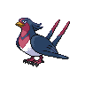
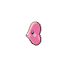

# Route 13

| Area                                                                          | Pokemon                                                                                            | &nbsp;                                                                                          | &nbsp;                                                                                         | &nbsp;                                                                                         | &nbsp;                                                                                          | &nbsp;                                                                                                     |
| ----------------------------------------------------------------------------- | -------------------------------------------------------------------------------------------------- | ----------------------------------------------------------------------------------------------- | ---------------------------------------------------------------------------------------------- | ---------------------------------------------------------------------------------------------- | ----------------------------------------------------------------------------------------------- | ---------------------------------------------------------------------------------------------------------- |
|  grass-normal        |   [Absol](/blaze-black-wiki/pokemon/359)  20%           |   [Drifblim](/blaze-black-wiki/pokemon/426)  20%  |   [Swellow](/blaze-black-wiki/pokemon/277)  10%   |   [Lunatone](/blaze-black-wiki/pokemon/337)  10% |   [Solrock](/blaze-black-wiki/pokemon/338)  10%    |   [Wormadam-plant](/blaze-black-wiki/pokemon/413)  10% |
|                                                                               |   [Mothim](/blaze-black-wiki/pokemon/414)  10%         |   [Pelipper](/blaze-black-wiki/pokemon/279)  10%  |
|  grass-doubles     |   [Golbat](/blaze-black-wiki/pokemon/042)  20%         |   [Tangela](/blaze-black-wiki/pokemon/114)  20%    |   [Nidorino](/blaze-black-wiki/pokemon/033)  10% |   [Nidorina](/blaze-black-wiki/pokemon/030)  10% |   [Yanma](/blaze-black-wiki/pokemon/193)  10%        |   [Gloom](/blaze-black-wiki/pokemon/044)  10%                   |
|                                                                               |   [Weepinbell](/blaze-black-wiki/pokemon/070)  10% |   [Skiploom](/blaze-black-wiki/pokemon/188)  10%  |
|  grass-special     |   [Audino](/blaze-black-wiki/pokemon/531)  80%         |   [Tangrowth](/blaze-black-wiki/pokemon/465)  5% |   [Crobat](/blaze-black-wiki/pokemon/169)  5%      |   [Nidoking](/blaze-black-wiki/pokemon/034)  5%  |   [Nidoqueen](/blaze-black-wiki/pokemon/031)  5% |
|  surf-normal           |   [Tentacruel](/blaze-black-wiki/pokemon/073)  60% |   [Starmie](/blaze-black-wiki/pokemon/121)  30%    |   [Kingdra](/blaze-black-wiki/pokemon/230)  10%   |
|  surf-special        |   [Shellder](/blaze-black-wiki/pokemon/090)  65%     |   [Krabby](/blaze-black-wiki/pokemon/098)  30%      |   [Luvdisc](/blaze-black-wiki/pokemon/370)  5%    |
|  fishing-normal  |   [Shellder](/blaze-black-wiki/pokemon/090)  60%     |   [Luvdisc](/blaze-black-wiki/pokemon/370)  30%    |   [Kingler](/blaze-black-wiki/pokemon/099)  5%    |   [Cloyster](/blaze-black-wiki/pokemon/091)  5%  |
| legendary-encounter surf-special                                          |   [Lugia](/blaze-black-wiki/pokemon/249)  1%            |