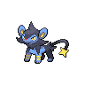
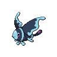

# Route 14

| Area                                                                             | Pokemon                                                                                          | &nbsp;                                                                                                                 | &nbsp;                                                                                         | &nbsp;                                                                                       | &nbsp;                                                                                         | &nbsp;                                                                                       |
| -------------------------------------------------------------------------------- | ------------------------------------------------------------------------------------------------ | ---------------------------------------------------------------------------------------------------------------------- | ---------------------------------------------------------------------------------------------- | -------------------------------------------------------------------------------------------- | ---------------------------------------------------------------------------------------------- | -------------------------------------------------------------------------------------------- |
|  grass-normal           |   [Gothorita](/blaze-black-wiki/pokemon/575)  20% |   [Duosion](/blaze-black-wiki/pokemon/578)  20%                           |   [Kirlia](/blaze-black-wiki/pokemon/281)  10%     |   [Lombre](/blaze-black-wiki/pokemon/271)  10%   |   [Shuckle](/blaze-black-wiki/pokemon/213)  10%   |   [Luxio](/blaze-black-wiki/pokemon/404)  10%     |
|                                                                                  |   [Carnivine](/blaze-black-wiki/pokemon/455)  10% |   [Skiploom](/blaze-black-wiki/pokemon/188)  10%                         |
|  grass-doubles        |   [Altaria](/blaze-black-wiki/pokemon/334)  20%     |   [Mienshao](/blaze-black-wiki/pokemon/620)  20%                         |   [Beheeyem](/blaze-black-wiki/pokemon/606)  10% |   [Grumpig](/blaze-black-wiki/pokemon/326)  10% |   [Drifblim](/blaze-black-wiki/pokemon/426)  10% |   [Breloom](/blaze-black-wiki/pokemon/286)  10% |
|                                                                                  |   [Tropius](/blaze-black-wiki/pokemon/357)  10%     |   [Galvantula](/blaze-black-wiki/pokemon/596)  10%                     |
|  grass-special        |   [Chansey](/blaze-black-wiki/pokemon/113)  75%     |   [Blissey](/blaze-black-wiki/pokemon/242)  25%                           |
|  surf-normal              |   [Seaking](/blaze-black-wiki/pokemon/119)  60%     |   [Lumineon](/blaze-black-wiki/pokemon/457)  40%                         |
|  surf-special           |   [Politoed](/blaze-black-wiki/pokemon/186)  60%   |   [Milotic](/blaze-black-wiki/pokemon/350)  40%                           |
|  fishing-normal     |   [Goldeen](/blaze-black-wiki/pokemon/118)  70%     |   [Basculin-red-striped](/blaze-black-wiki/pokemon/550)  30% |
|  fishing-special  |   [Goldeen](/blaze-black-wiki/pokemon/118)  60%     |   [Basculin-red-striped](/blaze-black-wiki/pokemon/550)  30% |   [Seaking](/blaze-black-wiki/pokemon/119)  10%   |