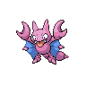

# Route 15

| Area                                                                       | Pokemon                                                                                            | &nbsp;                                                                                       | &nbsp;                                                                                          | &nbsp;                                                                                         | &nbsp;                                                                                             | &nbsp;                                                                                            |
| -------------------------------------------------------------------------- | -------------------------------------------------------------------------------------------------- | -------------------------------------------------------------------------------------------- | ----------------------------------------------------------------------------------------------- | ---------------------------------------------------------------------------------------------- | -------------------------------------------------------------------------------------------------- | ------------------------------------------------------------------------------------------------- |
|  grass-normal     |   [Throh](/blaze-black-wiki/pokemon/538)  20%           |   [Sawk](/blaze-black-wiki/pokemon/539)  20%       |   [Tyrogue](/blaze-black-wiki/pokemon/236)  10%    |   [Graveler](/blaze-black-wiki/pokemon/075)  10% |   [Gabite](/blaze-black-wiki/pokemon/444)  10%         |   [Pupitar](/blaze-black-wiki/pokemon/247)  10%      |
|                                                                            |   [Kangaskhan](/blaze-black-wiki/pokemon/115)  10% |   [Marowak](/blaze-black-wiki/pokemon/105)  10% |
|  grass-doubles  |   [Machoke](/blaze-black-wiki/pokemon/067)  20%       |   [Gurdurr](/blaze-black-wiki/pokemon/533)  20% |   [Pupitar](/blaze-black-wiki/pokemon/247)  10%    |   [Gligar](/blaze-black-wiki/pokemon/207)  10%     |   [Kangaskhan](/blaze-black-wiki/pokemon/115)  10% |   [Donphan](/blaze-black-wiki/pokemon/232)  10%      |
|                                                                            |   [Ursaring](/blaze-black-wiki/pokemon/217)  10%     |   [Marowak](/blaze-black-wiki/pokemon/105)  10% |
|  grass-special  |   [Audino](/blaze-black-wiki/pokemon/531)  70%         |   [Emolga](/blaze-black-wiki/pokemon/587)  10%   |   [Tyranitar](/blaze-black-wiki/pokemon/248)  5% |   [Gliscor](/blaze-black-wiki/pokemon/472)  5%    |   [Machamp](/blaze-black-wiki/pokemon/068)  5%        |   [Conkeldurr](/blaze-black-wiki/pokemon/534)  5% |
| legendary-encounter grass-doubles                                      |   [Groudon](/blaze-black-wiki/pokemon/383)  1%        |