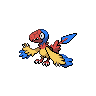

# Route 16

| Trainer            | 1                                                                                                 | 2                                                                                                 |
| ------------------ | ------------------------------------------------------------------------------------------------- | ------------------------------------------------------------------------------------------------- |
| Cycling Hector     |   [Staravia](/blaze-black-wiki/pokemon/397)  Lv. 30 |   [Ponyta](/blaze-black-wiki/pokemon/077)  Lv. 30     |
| Backpacker Peter   |   [Klink](/blaze-black-wiki/pokemon/599)  Lv. 30       |   [Prinplup](/blaze-black-wiki/pokemon/394)  Lv. 30 |
| Cycling Krissa     |   [Archen](/blaze-black-wiki/pokemon/566)  Lv. 30     |   [Grotle](/blaze-black-wiki/pokemon/388)  Lv. 30     |
| Policeman Daniel   |   [Houndoom](/blaze-black-wiki/pokemon/229)  Lv. 30 |   [Magmar](/blaze-black-wiki/pokemon/126)  Lv. 30     |
| Backpacker Lora    |   [Cherrim](/blaze-black-wiki/pokemon/421)  Lv. 30   |   [Monferno](/blaze-black-wiki/pokemon/391)  Lv. 30 |
| Backpacker Stephen |   [Corphish](/blaze-black-wiki/pokemon/341)  Lv. 30 |   [Ariados](/blaze-black-wiki/pokemon/168)  Lv. 30   |