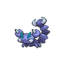

# Route 16

| Area                                                                    | Pokemon                                                                    | &nbsp;                                                                       | &nbsp;                                                                       | &nbsp;                                                                          | &nbsp;                                                                    | &nbsp;                                                                  |
| ----------------------------------------------------------------------- | -------------------------------------------------------------------------- | ---------------------------------------------------------------------------- | ---------------------------------------------------------------------------- | ------------------------------------------------------------------------------- | ------------------------------------------------------------------------- | ----------------------------------------------------------------------- |
|  grass-normal  |   [Ekans](/pokemon/023)  20%    |   [Pineco](/pokemon/204)  20%    |   [Skorupi](/pokemon/451)  10%  |   [Electrike](/pokemon/309)  10% |   [Combee](/pokemon/415)  10% |   [Paras](/pokemon/046)  10% |
|                                                                         |   [Buneary](/pokemon/427)  5% |   [Pawniard](/pokemon/624)  5% |   [Drifloon](/pokemon/425)  5% |   [Spoink](/pokemon/325)  5%        |