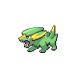

# Route 16

| Area                                                                    | Pokemon                                                                                     | &nbsp;                                                                                        | &nbsp;                                                                                        | &nbsp;                                                                                           | &nbsp;                                                                                     | &nbsp;                                                                                   |
| ----------------------------------------------------------------------- | ------------------------------------------------------------------------------------------- | --------------------------------------------------------------------------------------------- | --------------------------------------------------------------------------------------------- | ------------------------------------------------------------------------------------------------ | ------------------------------------------------------------------------------------------ | ---------------------------------------------------------------------------------------- |
|  grass-normal  |   [Ekans](/blaze-black-wiki/pokemon/023)  20%    |   [Pineco](/blaze-black-wiki/pokemon/204)  20%    |   [Skorupi](/blaze-black-wiki/pokemon/451)  10%  |   [Electrike](/blaze-black-wiki/pokemon/309)  10% |   [Combee](/blaze-black-wiki/pokemon/415)  10% |   [Paras](/blaze-black-wiki/pokemon/046)  10% |
|                                                                         |   [Buneary](/blaze-black-wiki/pokemon/427)  5% |   [Pawniard](/blaze-black-wiki/pokemon/624)  5% |   [Drifloon](/blaze-black-wiki/pokemon/425)  5% |   [Spoink](/blaze-black-wiki/pokemon/325)  5%        |