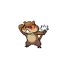
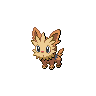

# Route 2

| Trainer          | 1                                                                                 | 2                                                                             | 3                                                                                 | 4                                                                               |
| ---------------- | --------------------------------------------------------------------------------- | ----------------------------------------------------------------------------- | --------------------------------------------------------------------------------- | ------------------------------------------------------------------------------- |
| Youngster Jimmy  |   [Hoothoot](/pokemon/163)  Lv. 7   |   [Wurmple](/pokemon/265)  Lv. 7 |   [Patrat](/pokemon/504)  Lv. 7       |
| Lass Mail        |   [Zigzagoon](/pokemon/263)  Lv. 7 |   [Meowth](/pokemon/052)  Lv. 7   |   [Pidgey](/pokemon/016)  Lv. 7       |   [Caterpie](/pokemon/010)  Lv. 7 |
| Youngster Roland |   [Lillipup](/pokemon/506)  Lv. 7   |   [Bidoof](/pokemon/399)  Lv. 7   |   [Kricketot](/pokemon/401)  Lv. 7 |   [Weedle](/pokemon/013)  Lv. 7     |

=== "Fire"

    | Trainer                                                                             | 1                                                                           | 2                                                                          |
    | ----------------------------------------------------------------------------------- | --------------------------------------------------------------------------- | -------------------------------------------------------------------------- |
    | Bianca   |   [Meowth](/pokemon/052)  Lv. 9 |   [Snivy](/pokemon/495)  Lv. 10 |

=== "Water"

    | Trainer                                                                             | 1                                                                           | 2                                                                          |
    | ----------------------------------------------------------------------------------- | --------------------------------------------------------------------------- | -------------------------------------------------------------------------- |
    | Bianca   |   [Meowth](/pokemon/052)  Lv. 9 |   [Tepig](/pokemon/498)  Lv. 10 |

=== "Grass"

    | Trainer                                                                             | 1                                                                                | 2                                                                           |
    | ----------------------------------------------------------------------------------- | -------------------------------------------------------------------------------- | --------------------------------------------------------------------------- |
    | Bianca   |   [Oshawott](/pokemon/501)  Lv. 10 |   [Meowth](/pokemon/052)  Lv. 9 |

 

## Bianca

=== "Fire"

    |      | Item | Nature | Ability    | Moves                                                     |
    | --------------------------------------------------------------------------- | ---- | ------ | ---------- | --------------------------------------------------------- |
    |   [Meowth](/pokemon/052)  Lv. 9 | N/A  | N/A    | Technician | <ul><li>N/A</li><li>N/A</li><li>N/A</li><li>N/A</li></ul> |
    |   [Snivy](/pokemon/495)  Lv. 10  | N/A  | N/A    | Contrary   | <ul><li>N/A</li><li>N/A</li><li>N/A</li><li>N/A</li></ul> |

=== "Water"

    |      | Item | Nature | Ability      | Moves                                                     |
    | --------------------------------------------------------------------------- | ---- | ------ | ------------ | --------------------------------------------------------- |
    |   [Meowth](/pokemon/052)  Lv. 9 | N/A  | N/A    | Technician   | <ul><li>N/A</li><li>N/A</li><li>N/A</li><li>N/A</li></ul> |
    |   [Tepig](/pokemon/498)  Lv. 10  | N/A  | N/A    | Adaptability | <ul><li>N/A</li><li>N/A</li><li>N/A</li><li>N/A</li></ul> |

=== "Grass"

    |           | Item | Nature | Ability      | Moves                                                     |
    | -------------------------------------------------------------------------------- | ---- | ------ | ------------ | --------------------------------------------------------- |
    |   [Oshawott](/pokemon/501)  Lv. 10 | N/A  | N/A    | Vital-Spirit | <ul><li>N/A</li><li>N/A</li><li>N/A</li><li>N/A</li></ul> |
    |   [Meowth](/pokemon/052)  Lv. 9      | N/A  | N/A    | Technician   | <ul><li>N/A</li><li>N/A</li><li>N/A</li><li>N/A</li></ul> |