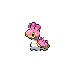
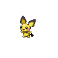
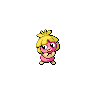
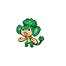

# Route 3

| Trainer               | 1                                                                                  | 2                                                                                  | 3                                                                              | 4                                                                              | 5                                                                            | 6                                                                                |
| --------------------- | ---------------------------------------------------------------------------------- | ---------------------------------------------------------------------------------- | ------------------------------------------------------------------------------ | ------------------------------------------------------------------------------ | ---------------------------------------------------------------------------- | -------------------------------------------------------------------------------- |
| Kumi & Amy D          |   [Nidoran-m](/pokemon/032)  Lv. 14 |   [Nidoran-f](/pokemon/029)  Lv. 14 |
| Nursery Aide Autumn   |   [Togepi](/pokemon/175)  Lv. 14       |   [Natu](/pokemon/177)  Lv. 14           |   [Ralts](/pokemon/280)  Lv. 14     |   [Munna](/pokemon/517)  Lv. 14     |
| Preschooler Doyle     |   [Squirtle](/pokemon/007)  Lv. 14   |   [Oshawott](/pokemon/501)  Lv. 14   |
| Preschooler Wendy     |   [Totodile](/pokemon/158)  Lv. 14   |   [Piplup](/pokemon/393)  Lv. 14       |
| Preschooler Tully     |   [Mudkip](/pokemon/258)  Lv. 14       |   [Shellos](/pokemon/422)  Lv. 14     |   [Psyduck](/pokemon/054)  Lv. 14 |
| Pkmn Breeder Adelaide |   [Igglybuff](/pokemon/174)  Lv. 12 |   [Cleffa](/pokemon/173)  Lv. 12       |   [Pichu](/pokemon/172)  Lv. 12     |   [Magby](/pokemon/240)  Lv. 12     |   [Elekid](/pokemon/239)  Lv. 12 |   [Smoochum](/pokemon/238)  Lv. 12 |
| School Kid Al         |   [Blitzle](/pokemon/522)  Lv. 15     |   [Mareep](/pokemon/179)  Lv. 15       |   [Flaaffy](/pokemon/180)  Lv. 15 |
| School Kid Marsha     |   [Phanpy](/pokemon/231)  Lv. 15       |   [Teddiursa](/pokemon/216)  Lv. 15 |   [Woobat](/pokemon/527)  Lv. 15   |   [Whismur](/pokemon/293)  Lv. 15 |
| School Kid Gina       |   [Wooper](/pokemon/194)  Lv. 16       |   [Taillow](/pokemon/276)  Lv. 16     |   [Lotad](/pokemon/270)  Lv. 16     |   [Seedot](/pokemon/273)  Lv. 16   |
| School Kid Edgar      |   [Shinx](/pokemon/403)  Lv. 16         |   [Luxio](/pokemon/404)  Lv. 16         |   [Nuzleaf](/pokemon/274)  Lv. 16 |   [Lombre](/pokemon/271)  Lv. 16   |
| Pkmn Breeder Galen    |   [Serperior](/pokemon/497)  Lv. 50 |   [Samurott](/pokemon/503)  Lv. 50   |   [Emboar](/pokemon/500)  Lv. 50   |

=== "Fire"

    | Trainer                                                                             | 1                                                                                | 2                                                                                    | 3                                                                              | 4                                                                                |
    | ----------------------------------------------------------------------------------- | -------------------------------------------------------------------------------- | ------------------------------------------------------------------------------------ | ------------------------------------------------------------------------------ | -------------------------------------------------------------------------------- |
    | Cheren   |   [Staravia](/pokemon/397)  Lv. 14 |   [Roggenrola](/pokemon/524)  Lv. 14 |   [Pansage](/pokemon/511)  Lv. 14 |   [Oshawott](/pokemon/501)  Lv. 16 |

=== "Water"

    | Trainer                                                                             | 1                                                                                | 2                                                                                    | 3                                                                              | 4                                                                          |
    | ----------------------------------------------------------------------------------- | -------------------------------------------------------------------------------- | ------------------------------------------------------------------------------------ | ------------------------------------------------------------------------------ | -------------------------------------------------------------------------- |
    | Cheren   |   [Staravia](/pokemon/397)  Lv. 14 |   [Roggenrola](/pokemon/524)  Lv. 14 |   [Pansear](/pokemon/513)  Lv. 14 |   [Snivy](/pokemon/495)  Lv. 16 |

=== "Grass"

    | Trainer                                                                             | 1                                                                                | 2                                                                                    | 3                                                                              | 4                                                                          |
    | ----------------------------------------------------------------------------------- | -------------------------------------------------------------------------------- | ------------------------------------------------------------------------------------ | ------------------------------------------------------------------------------ | -------------------------------------------------------------------------- |
    | Cheren   |   [Staravia](/pokemon/397)  Lv. 14 |   [Roggenrola](/pokemon/524)  Lv. 14 |   [Panpour](/pokemon/515)  Lv. 14 |   [Tepig](/pokemon/498)  Lv. 16 |

 

## Cheren

=== "Fire"

    |               | Item | Nature | Ability      | Moves                                                     |
    | ------------------------------------------------------------------------------------ | ---- | ------ | ------------ | --------------------------------------------------------- |
    |   [Staravia](/pokemon/397)  Lv. 14     | N/A  | N/A    | Reckless     | <ul><li>N/A</li><li>N/A</li><li>N/A</li><li>N/A</li></ul> |
    |   [Roggenrola](/pokemon/524)  Lv. 14 | N/A  | N/A    | Sturdy       | <ul><li>N/A</li><li>N/A</li><li>N/A</li><li>N/A</li></ul> |
    |   [Pansage](/pokemon/511)  Lv. 14       | N/A  | N/A    | Overgrow     | <ul><li>N/A</li><li>N/A</li><li>N/A</li><li>N/A</li></ul> |
    |   [Oshawott](/pokemon/501)  Lv. 16     | N/A  | N/A    | Vital-Spirit | <ul><li>N/A</li><li>N/A</li><li>N/A</li><li>N/A</li></ul> |

=== "Water"

    |               | Item | Nature | Ability  | Moves                                                     |
    | ------------------------------------------------------------------------------------ | ---- | ------ | -------- | --------------------------------------------------------- |
    |   [Staravia](/pokemon/397)  Lv. 14     | N/A  | N/A    | Reckless | <ul><li>N/A</li><li>N/A</li><li>N/A</li><li>N/A</li></ul> |
    |   [Roggenrola](/pokemon/524)  Lv. 14 | N/A  | N/A    | Sturdy   | <ul><li>N/A</li><li>N/A</li><li>N/A</li><li>N/A</li></ul> |
    |   [Pansear](/pokemon/513)  Lv. 14       | N/A  | N/A    | Blaze    | <ul><li>N/A</li><li>N/A</li><li>N/A</li><li>N/A</li></ul> |
    |   [Snivy](/pokemon/495)  Lv. 16           | N/A  | N/A    | Contrary | <ul><li>N/A</li><li>N/A</li><li>N/A</li><li>N/A</li></ul> |

=== "Grass"

    |               | Item | Nature | Ability      | Moves                                                     |
    | ------------------------------------------------------------------------------------ | ---- | ------ | ------------ | --------------------------------------------------------- |
    |   [Staravia](/pokemon/397)  Lv. 14     | N/A  | N/A    | Reckless     | <ul><li>N/A</li><li>N/A</li><li>N/A</li><li>N/A</li></ul> |
    |   [Roggenrola](/pokemon/524)  Lv. 14 | N/A  | N/A    | Sturdy       | <ul><li>N/A</li><li>N/A</li><li>N/A</li><li>N/A</li></ul> |
    |   [Panpour](/pokemon/515)  Lv. 14       | N/A  | N/A    | Torrent      | <ul><li>N/A</li><li>N/A</li><li>N/A</li><li>N/A</li></ul> |
    |   [Tepig](/pokemon/498)  Lv. 16           | N/A  | N/A    | Adaptability | <ul><li>N/A</li><li>N/A</li><li>N/A</li><li>N/A</li></ul> |