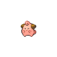
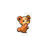
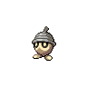
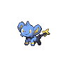

# Route 3

| Trainer               | 1                                                                                                   | 2                                                                                                   | 3                                                                                               | 4                                                                                               | 5                                                                                             | 6                                                                                                 |
| --------------------- | --------------------------------------------------------------------------------------------------- | --------------------------------------------------------------------------------------------------- | ----------------------------------------------------------------------------------------------- | ----------------------------------------------------------------------------------------------- | --------------------------------------------------------------------------------------------- | ------------------------------------------------------------------------------------------------- |
| Kumi & Amy D          |   [Nidoran-m](/blaze-black-wiki/pokemon/032)  Lv. 14 |   [Nidoran-f](/blaze-black-wiki/pokemon/029)  Lv. 14 |
| Nursery Aide Autumn   |   [Togepi](/blaze-black-wiki/pokemon/175)  Lv. 14       |   [Natu](/blaze-black-wiki/pokemon/177)  Lv. 14           |   [Ralts](/blaze-black-wiki/pokemon/280)  Lv. 14     |   [Munna](/blaze-black-wiki/pokemon/517)  Lv. 14     |
| Preschooler Doyle     |   [Squirtle](/blaze-black-wiki/pokemon/007)  Lv. 14   |   [Oshawott](/blaze-black-wiki/pokemon/501)  Lv. 14   |
| Preschooler Wendy     |   [Totodile](/blaze-black-wiki/pokemon/158)  Lv. 14   |   [Piplup](/blaze-black-wiki/pokemon/393)  Lv. 14       |
| Preschooler Tully     |   [Mudkip](/blaze-black-wiki/pokemon/258)  Lv. 14       |   [Shellos](/blaze-black-wiki/pokemon/422)  Lv. 14     |   [Psyduck](/blaze-black-wiki/pokemon/054)  Lv. 14 |
| Pkmn Breeder Adelaide |   [Igglybuff](/blaze-black-wiki/pokemon/174)  Lv. 12 |   [Cleffa](/blaze-black-wiki/pokemon/173)  Lv. 12       |   [Pichu](/blaze-black-wiki/pokemon/172)  Lv. 12     |   [Magby](/blaze-black-wiki/pokemon/240)  Lv. 12     |   [Elekid](/blaze-black-wiki/pokemon/239)  Lv. 12 |   [Smoochum](/blaze-black-wiki/pokemon/238)  Lv. 12 |
| School Kid Al         |   [Blitzle](/blaze-black-wiki/pokemon/522)  Lv. 15     |   [Mareep](/blaze-black-wiki/pokemon/179)  Lv. 15       |   [Flaaffy](/blaze-black-wiki/pokemon/180)  Lv. 15 |
| School Kid Marsha     |   [Phanpy](/blaze-black-wiki/pokemon/231)  Lv. 15       |   [Teddiursa](/blaze-black-wiki/pokemon/216)  Lv. 15 |   [Woobat](/blaze-black-wiki/pokemon/527)  Lv. 15   |   [Whismur](/blaze-black-wiki/pokemon/293)  Lv. 15 |
| School Kid Gina       |   [Wooper](/blaze-black-wiki/pokemon/194)  Lv. 16       |   [Taillow](/blaze-black-wiki/pokemon/276)  Lv. 16     |   [Lotad](/blaze-black-wiki/pokemon/270)  Lv. 16     |   [Seedot](/blaze-black-wiki/pokemon/273)  Lv. 16   |
| School Kid Edgar      |   [Shinx](/blaze-black-wiki/pokemon/403)  Lv. 16         |   [Luxio](/blaze-black-wiki/pokemon/404)  Lv. 16         |   [Nuzleaf](/blaze-black-wiki/pokemon/274)  Lv. 16 |   [Lombre](/blaze-black-wiki/pokemon/271)  Lv. 16   |
| Pkmn Breeder Galen    |   [Serperior](/blaze-black-wiki/pokemon/497)  Lv. 50 |   [Samurott](/blaze-black-wiki/pokemon/503)  Lv. 50   |   [Emboar](/blaze-black-wiki/pokemon/500)  Lv. 50   |

=== "Fire"

    | Trainer                                                                             | 1                                                                                                 | 2                                                                                                     | 3                                                                                               | 4                                                                                                 |
    | ----------------------------------------------------------------------------------- | ------------------------------------------------------------------------------------------------- | ----------------------------------------------------------------------------------------------------- | ----------------------------------------------------------------------------------------------- | ------------------------------------------------------------------------------------------------- |
    | Cheren   |   [Staravia](/blaze-black-wiki/pokemon/397)  Lv. 14 |   [Roggenrola](/blaze-black-wiki/pokemon/524)  Lv. 14 |   [Pansage](/blaze-black-wiki/pokemon/511)  Lv. 14 |   [Oshawott](/blaze-black-wiki/pokemon/501)  Lv. 16 |

=== "Water"

    | Trainer                                                                             | 1                                                                                                 | 2                                                                                                     | 3                                                                                               | 4                                                                                           |
    | ----------------------------------------------------------------------------------- | ------------------------------------------------------------------------------------------------- | ----------------------------------------------------------------------------------------------------- | ----------------------------------------------------------------------------------------------- | ------------------------------------------------------------------------------------------- |
    | Cheren   |   [Staravia](/blaze-black-wiki/pokemon/397)  Lv. 14 |   [Roggenrola](/blaze-black-wiki/pokemon/524)  Lv. 14 |   [Pansear](/blaze-black-wiki/pokemon/513)  Lv. 14 |   [Snivy](/blaze-black-wiki/pokemon/495)  Lv. 16 |

=== "Grass"

    | Trainer                                                                             | 1                                                                                                 | 2                                                                                                     | 3                                                                                               | 4                                                                                           |
    | ----------------------------------------------------------------------------------- | ------------------------------------------------------------------------------------------------- | ----------------------------------------------------------------------------------------------------- | ----------------------------------------------------------------------------------------------- | ------------------------------------------------------------------------------------------- |
    | Cheren   |   [Staravia](/blaze-black-wiki/pokemon/397)  Lv. 14 |   [Roggenrola](/blaze-black-wiki/pokemon/524)  Lv. 14 |   [Panpour](/blaze-black-wiki/pokemon/515)  Lv. 14 |   [Tepig](/blaze-black-wiki/pokemon/498)  Lv. 16 |

 

## Cheren

=== "Fire"

    |                                | Item | Nature | Ability      | Moves                                                     |
    | ----------------------------------------------------------------------------------------------------- | ---- | ------ | ------------ | --------------------------------------------------------- |
    |   [Staravia](/blaze-black-wiki/pokemon/397)  Lv. 14     | N/A  | N/A    | Reckless     | <ul><li>N/A</li><li>N/A</li><li>N/A</li><li>N/A</li></ul> |
    |   [Roggenrola](/blaze-black-wiki/pokemon/524)  Lv. 14 | N/A  | N/A    | Sturdy       | <ul><li>N/A</li><li>N/A</li><li>N/A</li><li>N/A</li></ul> |
    |   [Pansage](/blaze-black-wiki/pokemon/511)  Lv. 14       | N/A  | N/A    | Overgrow     | <ul><li>N/A</li><li>N/A</li><li>N/A</li><li>N/A</li></ul> |
    |   [Oshawott](/blaze-black-wiki/pokemon/501)  Lv. 16     | N/A  | N/A    | Vital-Spirit | <ul><li>N/A</li><li>N/A</li><li>N/A</li><li>N/A</li></ul> |

=== "Water"

    |                                | Item | Nature | Ability  | Moves                                                     |
    | ----------------------------------------------------------------------------------------------------- | ---- | ------ | -------- | --------------------------------------------------------- |
    |   [Staravia](/blaze-black-wiki/pokemon/397)  Lv. 14     | N/A  | N/A    | Reckless | <ul><li>N/A</li><li>N/A</li><li>N/A</li><li>N/A</li></ul> |
    |   [Roggenrola](/blaze-black-wiki/pokemon/524)  Lv. 14 | N/A  | N/A    | Sturdy   | <ul><li>N/A</li><li>N/A</li><li>N/A</li><li>N/A</li></ul> |
    |   [Pansear](/blaze-black-wiki/pokemon/513)  Lv. 14       | N/A  | N/A    | Blaze    | <ul><li>N/A</li><li>N/A</li><li>N/A</li><li>N/A</li></ul> |
    |   [Snivy](/blaze-black-wiki/pokemon/495)  Lv. 16           | N/A  | N/A    | Contrary | <ul><li>N/A</li><li>N/A</li><li>N/A</li><li>N/A</li></ul> |

=== "Grass"

    |                                | Item | Nature | Ability      | Moves                                                     |
    | ----------------------------------------------------------------------------------------------------- | ---- | ------ | ------------ | --------------------------------------------------------- |
    |   [Staravia](/blaze-black-wiki/pokemon/397)  Lv. 14     | N/A  | N/A    | Reckless     | <ul><li>N/A</li><li>N/A</li><li>N/A</li><li>N/A</li></ul> |
    |   [Roggenrola](/blaze-black-wiki/pokemon/524)  Lv. 14 | N/A  | N/A    | Sturdy       | <ul><li>N/A</li><li>N/A</li><li>N/A</li><li>N/A</li></ul> |
    |   [Panpour](/blaze-black-wiki/pokemon/515)  Lv. 14       | N/A  | N/A    | Torrent      | <ul><li>N/A</li><li>N/A</li><li>N/A</li><li>N/A</li></ul> |
    |   [Tepig](/blaze-black-wiki/pokemon/498)  Lv. 16           | N/A  | N/A    | Adaptability | <ul><li>N/A</li><li>N/A</li><li>N/A</li><li>N/A</li></ul> |