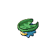

# Route 3

| Area                                                                             | Pokemon                                                                                         | &nbsp;                                                                                           | &nbsp;                                                                                           | &nbsp;                                                                                        | &nbsp;                                                                                     | &nbsp;                                                                                      |
| -------------------------------------------------------------------------------- | ----------------------------------------------------------------------------------------------- | ------------------------------------------------------------------------------------------------ | ------------------------------------------------------------------------------------------------ | --------------------------------------------------------------------------------------------- | ------------------------------------------------------------------------------------------ | ------------------------------------------------------------------------------------------- |
|  grass-normal           |   [Mareep](/blaze-black-wiki/pokemon/179)  20%      |   [Taillow](/blaze-black-wiki/pokemon/276)  20%     |   [Shellos](/blaze-black-wiki/pokemon/422)  10%     |   [Sunkern](/blaze-black-wiki/pokemon/191)  10%  |   [Lotad](/blaze-black-wiki/pokemon/270)  10%   |   [Seedot](/blaze-black-wiki/pokemon/273)  10%  |
|                                                                                  |   [Shinx](/blaze-black-wiki/pokemon/403)  10%        |   [Abra](/blaze-black-wiki/pokemon/063)  5%            |   [Phanpy](/blaze-black-wiki/pokemon/231)  5%        |
|  grass-doubles        |   [Blitzle](/blaze-black-wiki/pokemon/522)  20%    |   [Pidove](/blaze-black-wiki/pokemon/519)  20%       |   [Growlithe](/blaze-black-wiki/pokemon/058)  10% |   [Vulpix](/blaze-black-wiki/pokemon/037)  10%    |   [Hoppip](/blaze-black-wiki/pokemon/187)  10% |   [Budew](/blaze-black-wiki/pokemon/406)  10%    |
|                                                                                  |   [Azumarill](/blaze-black-wiki/pokemon/184)  5% |   [Houndour](/blaze-black-wiki/pokemon/228)  5%    |   [Volbeat](/blaze-black-wiki/pokemon/313)  4%      |   [Illumise](/blaze-black-wiki/pokemon/314)  4% |   [Lombre](/blaze-black-wiki/pokemon/271)  1%  |   [Nuzleaf](/blaze-black-wiki/pokemon/274)  1% |
|  grass-special        |   [Audino](/blaze-black-wiki/pokemon/531)  70%      |   [Oshawott](/blaze-black-wiki/pokemon/501)  10%   |   [Squirtle](/blaze-black-wiki/pokemon/007)  5%    |   [Totodile](/blaze-black-wiki/pokemon/158)  5% |   [Mudkip](/blaze-black-wiki/pokemon/258)  5%  |   [Piplup](/blaze-black-wiki/pokemon/393)  5%   |
|  surf-normal              |   [Slowpoke](/blaze-black-wiki/pokemon/079)  60%  |   [Psyduck](/blaze-black-wiki/pokemon/054)  30%     |   [Marill](/blaze-black-wiki/pokemon/183)  10%       |
|  surf-special           |   [Golduck](/blaze-black-wiki/pokemon/055)  60%    |   [Azumarill](/blaze-black-wiki/pokemon/184)  30% |   [Slowbro](/blaze-black-wiki/pokemon/080)  5%      |   [Slowking](/blaze-black-wiki/pokemon/199)  5% |
|  fishing-normal     |   [Poliwag](/blaze-black-wiki/pokemon/060)  60%    |   [Slowpoke](/blaze-black-wiki/pokemon/079)  30%   |   [Chinchou](/blaze-black-wiki/pokemon/170)  5%    |   [Remoraid](/blaze-black-wiki/pokemon/223)  5% |
|  fishing-special  |   [Chinchou](/blaze-black-wiki/pokemon/170)  60%  |   [Qwilfish](/blaze-black-wiki/pokemon/211)  30%   |   [Remoraid](/blaze-black-wiki/pokemon/223)  10%   |