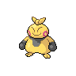
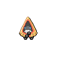
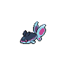
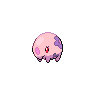

# Route 4

| Trainer            | 1                                                                                  | 2                                                                                  | 3                                                                                    | 4                                                                                  | 5                                                                                |
| ------------------ | ---------------------------------------------------------------------------------- | ---------------------------------------------------------------------------------- | ------------------------------------------------------------------------------------ | ---------------------------------------------------------------------------------- | -------------------------------------------------------------------------------- |
| Backpacker Keane   |   [Sandshrew](/pokemon/027)  Lv. 27 |   [Exeggcute](/pokemon/102)  Lv. 27 |   [Diglett](/pokemon/050)  Lv. 27       |   [Sunkern](/pokemon/191)  Lv. 27     |   [Swablu](/pokemon/333)  Lv. 27     |
| Worker Gus         |   [Makuhita](/pokemon/296)  Lv. 25   |   [Baltoy](/pokemon/343)  Lv. 25       |   [Cranidos](/pokemon/408)  Lv. 25     |
| Backpacker Anna    |   [Wingull](/pokemon/278)  Lv. 27     |   [Eevee](/pokemon/133)  Lv. 27         |   [Spearow](/pokemon/021)  Lv. 27       |   [Electrike](/pokemon/309)  Lv. 27 |   [Buizel](/pokemon/418)  Lv. 27     |
| Backpacker Jill    |   [Cherubi](/pokemon/420)  Lv. 27     |   [Snivy](/pokemon/495)  Lv. 27         |   [Pidove](/pokemon/519)  Lv. 27         |   [Darumaka](/pokemon/554)  Lv. 27   |   [Deerling](/pokemon/585)  Lv. 27 |
| Backpacker Waylon  |   [Tepig](/pokemon/498)  Lv. 27         |   [Ducklett](/pokemon/580)  Lv. 27   |   [Vanillite](/pokemon/582)  Lv. 27   |   [Ferroseed](/pokemon/597)  Lv. 27 |   [Mienfoo](/pokemon/619)  Lv. 27   |
| Worker Scott       |   [Boldore](/pokemon/525)  Lv. 26     |   [Graveler](/pokemon/075)  Lv. 26   |   [Hippopotas](/pokemon/449)  Lv. 26 |
| Worker Zack        |   [Rhyhorn](/pokemon/111)  Lv. 27     |   [Sandslash](/pokemon/028)  Lv. 27 |
| Backpacker Jerome  |   [Lileep](/pokemon/345)  Lv. 28       |   [Snorunt](/pokemon/361)  Lv. 28     |   [Spheal](/pokemon/363)  Lv. 28         |
| Worker Shelby      |   [Machoke](/pokemon/067)  Lv. 28     |
| Fisherman Hubert   |   [Omanyte](/pokemon/138)  Lv. 26     |   [Remoraid](/pokemon/223)  Lv. 26   |   [Magikarp](/pokemon/129)  Lv. 26     |   [Horsea](/pokemon/116)  Lv. 26       |   [Wailmer](/pokemon/320)  Lv. 26   |
| Fisherman Andrew   |   [Kabuto](/pokemon/140)  Lv. 26       |   [Finneon](/pokemon/456)  Lv. 26     |   [Frillish](/pokemon/592)  Lv. 26     |   [Chinchou](/pokemon/170)  Lv. 26   |   [Feebas](/pokemon/349)  Lv. 26     |
| Parasol Lady April |   [Mantyke](/pokemon/458)  Lv. 26     |   [Munchlax](/pokemon/446)  Lv. 26   |   [Snover](/pokemon/459)  Lv. 26         |   [Shieldon](/pokemon/410)  Lv. 26   |

=== "Fire"

    | Trainer                                                                             | 1                                                                          | 2                                                                                | 3                                                                              | 4                                                                              |
    | ----------------------------------------------------------------------------------- | -------------------------------------------------------------------------- | -------------------------------------------------------------------------------- | ------------------------------------------------------------------------------ | ------------------------------------------------------------------------------ |
    | Bianca   |   [Munna](/pokemon/517)  Lv. 29 |   [Simipour](/pokemon/516)  Lv. 29 |   [Persian](/pokemon/053)  Lv. 31 |   [Servine](/pokemon/496)  Lv. 31 |

=== "Water"

    | Trainer                                                                             | 1                                                                          | 2                                                                                | 3                                                                              | 4                                                                              |
    | ----------------------------------------------------------------------------------- | -------------------------------------------------------------------------- | -------------------------------------------------------------------------------- | ------------------------------------------------------------------------------ | ------------------------------------------------------------------------------ |
    | Bianca   |   [Munna](/pokemon/517)  Lv. 29 |   [Simisage](/pokemon/512)  Lv. 29 |   [Persian](/pokemon/053)  Lv. 31 |   [Pignite](/pokemon/499)  Lv. 31 |

=== "Grass"

    | Trainer                                                                             | 1                                                                          | 2                                                                                | 3                                                                              | 4                                                                            |
    | ----------------------------------------------------------------------------------- | -------------------------------------------------------------------------- | -------------------------------------------------------------------------------- | ------------------------------------------------------------------------------ | ---------------------------------------------------------------------------- |
    | Bianca   |   [Munna](/pokemon/517)  Lv. 29 |   [Simisear](/pokemon/514)  Lv. 29 |   [Persian](/pokemon/053)  Lv. 31 |   [Dewott](/pokemon/502)  Lv. 31 |

 

=== "Fire"

    | Trainer                                                                             | 1                                                                                | 2                                                                              | 3                                                                              | 4                                                                                | 5                                                                            |
    | ----------------------------------------------------------------------------------- | -------------------------------------------------------------------------------- | ------------------------------------------------------------------------------ | ------------------------------------------------------------------------------ | -------------------------------------------------------------------------------- | ---------------------------------------------------------------------------- |
    | Cheren   |   [Staravia](/pokemon/397)  Lv. 31 |   [Boldore](/pokemon/525)  Lv. 31 |   [Kadabra](/pokemon/064)  Lv. 31 |   [Simisear](/pokemon/514)  Lv. 31 |   [Dewott](/pokemon/502)  Lv. 31 |

=== "Water"

    | Trainer                                                                             | 1                                                                                | 2                                                                              | 3                                                                              | 4                                                                                | 5                                                                              |
    | ----------------------------------------------------------------------------------- | -------------------------------------------------------------------------------- | ------------------------------------------------------------------------------ | ------------------------------------------------------------------------------ | -------------------------------------------------------------------------------- | ------------------------------------------------------------------------------ |
    | Cheren   |   [Staravia](/pokemon/397)  Lv. 31 |   [Boldore](/pokemon/525)  Lv. 31 |   [Kadabra](/pokemon/064)  Lv. 31 |   [Simipour](/pokemon/516)  Lv. 31 |   [Servine](/pokemon/496)  Lv. 31 |

=== "Grass"

    | Trainer                                                                             | 1                                                                                | 2                                                                              | 3                                                                              | 4                                                                                | 5                                                                              |
    | ----------------------------------------------------------------------------------- | -------------------------------------------------------------------------------- | ------------------------------------------------------------------------------ | ------------------------------------------------------------------------------ | -------------------------------------------------------------------------------- | ------------------------------------------------------------------------------ |
    | Cheren   |   [Staravia](/pokemon/397)  Lv. 31 |   [Boldore](/pokemon/525)  Lv. 31 |   [Kadabra](/pokemon/064)  Lv. 31 |   [Simisage](/pokemon/512)  Lv. 31 |   [Pignite](/pokemon/499)  Lv. 31 |

 

## Bianca

=== "Fire"

    |           | Item                                                                 | Nature | Ability    | Moves                                                     |
    | -------------------------------------------------------------------------------- | -------------------------------------------------------------------- | ------ | ---------- | --------------------------------------------------------- |
    |   [Munna](/pokemon/517)  Lv. 29       | N/A                                                                  | N/A    | Analytic   | <ul><li>N/A</li><li>N/A</li><li>N/A</li><li>N/A</li></ul> |
    |   [Simipour](/pokemon/516)  Lv. 29 | N/A                                                                  | N/A    | Unburden   | <ul><li>N/A</li><li>N/A</li><li>N/A</li><li>N/A</li></ul> |
    |   [Persian](/pokemon/053)  Lv. 31   | N/A                                                                  | N/A    | Technician | <ul><li>N/A</li><li>N/A</li><li>N/A</li><li>N/A</li></ul> |
    |   [Servine](/pokemon/496)  Lv. 31   |    Sitrus berry | N/A    | Contrary   | <ul><li>N/A</li><li>N/A</li><li>N/A</li><li>N/A</li></ul> |

=== "Water"

    |           | Item                                                                 | Nature | Ability      | Moves                                                     |
    | -------------------------------------------------------------------------------- | -------------------------------------------------------------------- | ------ | ------------ | --------------------------------------------------------- |
    |   [Munna](/pokemon/517)  Lv. 29       | N/A                                                                  | N/A    | Analytic     | <ul><li>N/A</li><li>N/A</li><li>N/A</li><li>N/A</li></ul> |
    |   [Simisage](/pokemon/512)  Lv. 29 | N/A                                                                  | N/A    | Unburden     | <ul><li>N/A</li><li>N/A</li><li>N/A</li><li>N/A</li></ul> |
    |   [Persian](/pokemon/053)  Lv. 31   | N/A                                                                  | N/A    | Technician   | <ul><li>N/A</li><li>N/A</li><li>N/A</li><li>N/A</li></ul> |
    |   [Pignite](/pokemon/499)  Lv. 31   |    Sitrus berry | N/A    | Adaptability | <ul><li>N/A</li><li>N/A</li><li>N/A</li><li>N/A</li></ul> |

=== "Grass"

    |           | Item                                                                 | Nature | Ability      | Moves                                                     |
    | -------------------------------------------------------------------------------- | -------------------------------------------------------------------- | ------ | ------------ | --------------------------------------------------------- |
    |   [Munna](/pokemon/517)  Lv. 29       | N/A                                                                  | N/A    | Analytic     | <ul><li>N/A</li><li>N/A</li><li>N/A</li><li>N/A</li></ul> |
    |   [Simisear](/pokemon/514)  Lv. 29 | N/A                                                                  | N/A    | Unburden     | <ul><li>N/A</li><li>N/A</li><li>N/A</li><li>N/A</li></ul> |
    |   [Persian](/pokemon/053)  Lv. 31   | N/A                                                                  | N/A    | Technician   | <ul><li>N/A</li><li>N/A</li><li>N/A</li><li>N/A</li></ul> |
    |   [Dewott](/pokemon/502)  Lv. 31     |    Sitrus berry | N/A    | Vital-Spirit | <ul><li>N/A</li><li>N/A</li><li>N/A</li><li>N/A</li></ul> |

## Cheren

=== "Fire"

    |           | Item                                                                    | Nature | Ability      | Moves                                                     |
    | -------------------------------------------------------------------------------- | ----------------------------------------------------------------------- | ------ | ------------ | --------------------------------------------------------- |
    |   [Staravia](/pokemon/397)  Lv. 31 |    Sharp beak          | N/A    | Reckless     | <ul><li>N/A</li><li>N/A</li><li>N/A</li><li>N/A</li></ul> |
    |   [Boldore](/pokemon/525)  Lv. 31   |    Hard stone          | N/A    | Sturdy       | <ul><li>N/A</li><li>N/A</li><li>N/A</li><li>N/A</li></ul> |
    |   [Kadabra](/pokemon/064)  Lv. 31   |    Twisted spoon | N/A    | Magic-Guard  | <ul><li>N/A</li><li>N/A</li><li>N/A</li><li>N/A</li></ul> |
    |   [Simisear](/pokemon/514)  Lv. 31 |    Expert belt       | N/A    | Blaze        | <ul><li>N/A</li><li>N/A</li><li>N/A</li><li>N/A</li></ul> |
    |   [Dewott](/pokemon/502)  Lv. 31     |    Sitrus berry    | N/A    | Vital-Spirit | <ul><li>N/A</li><li>N/A</li><li>N/A</li><li>N/A</li></ul> |

=== "Water"

    |           | Item                                                                    | Nature | Ability     | Moves                                                     |
    | -------------------------------------------------------------------------------- | ----------------------------------------------------------------------- | ------ | ----------- | --------------------------------------------------------- |
    |   [Staravia](/pokemon/397)  Lv. 31 |    Sharp beak          | N/A    | Reckless    | <ul><li>N/A</li><li>N/A</li><li>N/A</li><li>N/A</li></ul> |
    |   [Boldore](/pokemon/525)  Lv. 31   |    Hard stone          | N/A    | Sturdy      | <ul><li>N/A</li><li>N/A</li><li>N/A</li><li>N/A</li></ul> |
    |   [Kadabra](/pokemon/064)  Lv. 31   |    Twisted spoon | N/A    | Magic-Guard | <ul><li>N/A</li><li>N/A</li><li>N/A</li><li>N/A</li></ul> |
    |   [Simipour](/pokemon/516)  Lv. 31 |    Expert belt       | N/A    | Torrent     | <ul><li>N/A</li><li>N/A</li><li>N/A</li><li>N/A</li></ul> |
    |   [Servine](/pokemon/496)  Lv. 31   |    Sitrus berry    | N/A    | Contrary    | <ul><li>N/A</li><li>N/A</li><li>N/A</li><li>N/A</li></ul> |

=== "Grass"

    |           | Item                                                                    | Nature | Ability      | Moves                                                     |
    | -------------------------------------------------------------------------------- | ----------------------------------------------------------------------- | ------ | ------------ | --------------------------------------------------------- |
    |   [Staravia](/pokemon/397)  Lv. 31 |    Sharp beak          | N/A    | Reckless     | <ul><li>N/A</li><li>N/A</li><li>N/A</li><li>N/A</li></ul> |
    |   [Boldore](/pokemon/525)  Lv. 31   |    Hard stone          | N/A    | Sturdy       | <ul><li>N/A</li><li>N/A</li><li>N/A</li><li>N/A</li></ul> |
    |   [Kadabra](/pokemon/064)  Lv. 31   |    Twisted spoon | N/A    | Magic-Guard  | <ul><li>N/A</li><li>N/A</li><li>N/A</li><li>N/A</li></ul> |
    |   [Simisage](/pokemon/512)  Lv. 31 |    Expert belt       | N/A    | Overgrow     | <ul><li>N/A</li><li>N/A</li><li>N/A</li><li>N/A</li></ul> |
    |   [Pignite](/pokemon/499)  Lv. 31   |    Sitrus berry    | N/A    | Adaptability | <ul><li>N/A</li><li>N/A</li><li>N/A</li><li>N/A</li></ul> |