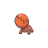
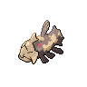

# Route 4

| Area                                                                             | Pokemon                                                                         | &nbsp;                                                                           | &nbsp;                                                                          | &nbsp;                                                                       | &nbsp;                                                                    | &nbsp;                                                                        |
| -------------------------------------------------------------------------------- | ------------------------------------------------------------------------------- | -------------------------------------------------------------------------------- | ------------------------------------------------------------------------------- | ---------------------------------------------------------------------------- | ------------------------------------------------------------------------- | ----------------------------------------------------------------------------- |
|  sand-normal              |   [Sandile](/pokemon/551)  20%     |   [Sandshrew](/pokemon/027)  20%  |   [Darumaka](/pokemon/554)  10%   |   [Scraggy](/pokemon/559)  10%  |   [Cacnea](/pokemon/331)  10% |   [Trapinch](/pokemon/328)  10% |
|                                                                                  |   [Vullaby](/pokemon/629)  10%     |   [Hippopotas](/pokemon/449)  5% |   [Elgyem](/pokemon/605)  5%        |
|  surf-normal              |   [Frillish](/pokemon/592)  60%   |   [Clamperl](/pokemon/366)  30%    |   [Relicanth](/pokemon/369)  10% |
|  surf-special           |   [Jellicent](/pokemon/593)  60% |   [Relicanth](/pokemon/369)  30%  |   [Huntail](/pokemon/367)  5%      |   [Gorebyss](/pokemon/368)  5% |
|  fishing-normal     |   [Krabby](/pokemon/098)  60%       |   [Corphish](/pokemon/341)  30%    |   [Clamperl](/pokemon/366)  10%   |
|  fishing-special  |   [Clamperl](/pokemon/366)  60%   |   [Frillish](/pokemon/592)  30%    |   [Relicanth](/pokemon/369)  10% |